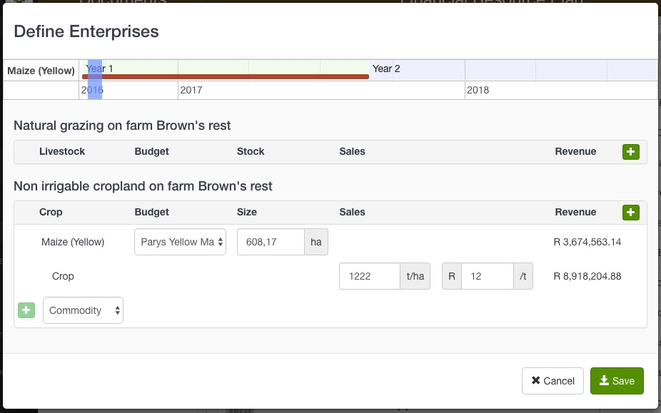
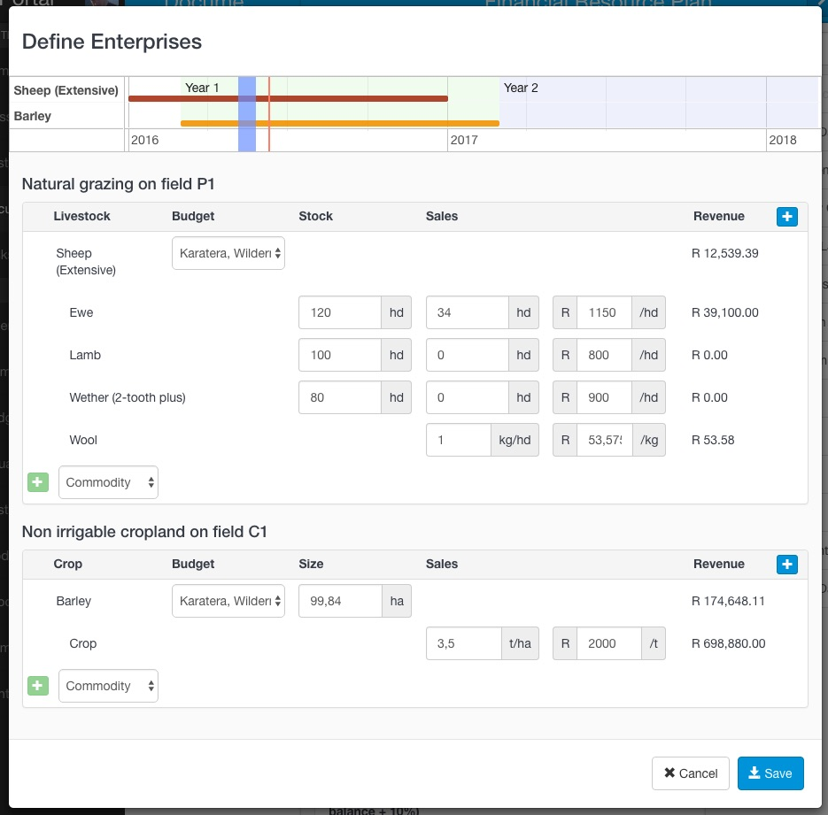

## Define Enterprises

This tool combines the land components with the budgets you have prepared. Each land component can have one or many budgets applied to it to forecast the customer's expected production revenue.

1. Select **Define Enterprises** from the Toolbox menu. The system will automatically list the land components created in the previous step.

2. Move the blue bar along the time line to prepare a production schedule for a particular time period. Year 1 and Year 2 time periods are indicated on the time line and are determined by the start date of the FRP. 
3. Click the **Plus** button on a land component to apply a budget to it. A list of available budgets will appear in the drop down list, i.e crop budgets on cropland and livestock budgets on grazing. 

   - You can make adjustments to the area applicable to the production schedule in the Size block.
   - You can edit the income assumptions pulled through from the budgets in the Sales blocks.
   - Livestock budgets will contain an extra column for capturing breeding stock figures. Additional stock categories can be selected from the Commodity drop down list.
   - If you do not have any budgets prepared for the customer's production region a warning message will be displayed.

4. Add more budgets to the land components until you have prepared the production schedule for the full 2 year period.
5. Click Save

----
FAQ

*How do I repeat a prepared budget for short crop cycles?*
Add the budget to the cropland and move the marker in the time line to a new starting month