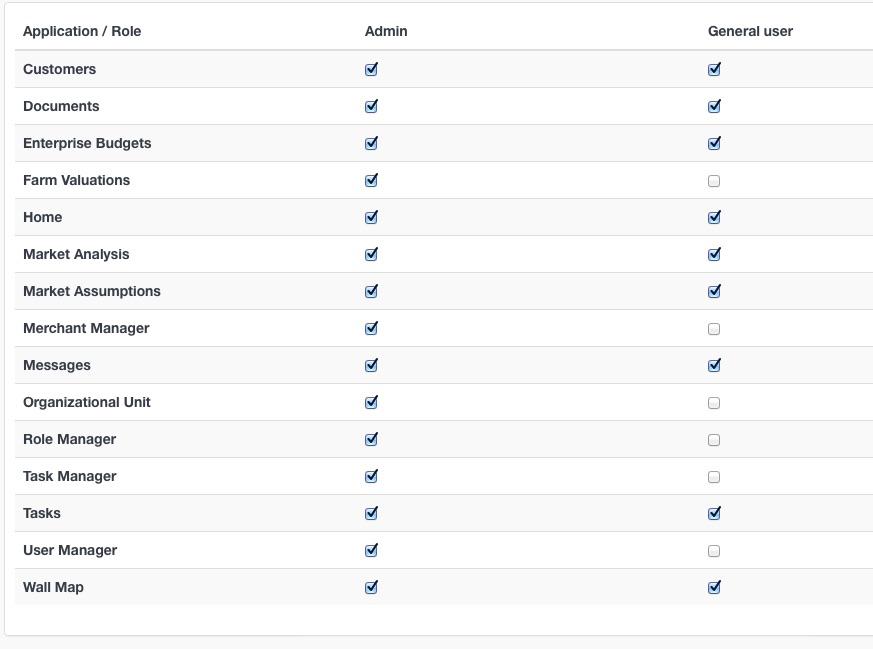
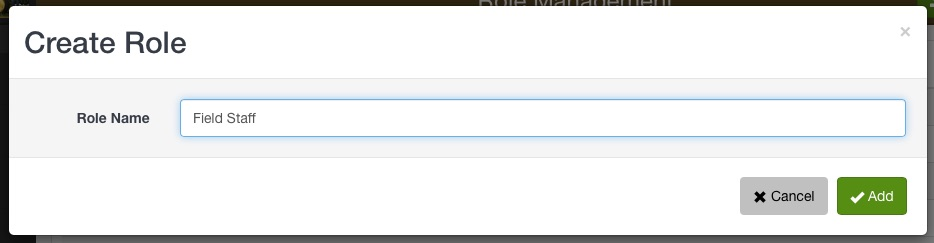

Congratulations on signing up for an Agrista Enterprise account! During the registration process a primary user account was created. You can use this account to get set up and customise your Enterprise instance.

Setting up your organisation to use Agrista basically involves the following steps:

`1` Signing in as the administrator

`2` Creating users, roles and organisation units 

`3` Assign users to roles and organisational units

## Signing in as the administrator

During the Enterprise registration process, your company was required to nominate a primary contact. This person is automatically added into your Enterprise instance as the administrator.

Sign in use this account.

## Managing Users

Your Enterprise account can be configured to accommodate your company's size and structure. Using user roles and organisation units you can restrict the features and customer groups that your users can have access to.

### Role manager

The Role Manager is a tool to control what users can and cannot do within the system, e.g. a manager would need access to the Reports feature, while field staff may only need access to the tasks feature. A user role is assigned to each user when their account is created. It grants them access to the basic system and controls the which applications they will see on the man menu.

 

#### Add a user role

Set up different user roles in the Role Manager and assign applications to each role.

1. Navigate to Role Manager on the main menu
2. Click the New Role button
3. Enter a name for the role
4. Click Add
5. Assign applications to the role
6. Click the Save button

.. warning:: Remember to click the save button, otherwise your changes will not be updated. 

### Organisational units

Organisational units are a means of arranging your users and customers into groups, based either on geographical regions or branches. Each Enterprise account is created with a single *Branch* and *Region*. These can be edited to include the whole scope of your business, or more branches and regions can be added to mirror your company's existing structure. 

**Branches**
These are physical locations where your business is conducted and your staff are located. 

**Regions**
These are geographical areas in which your customers are located. 

Place each user in the appropriate Branch and Region when they are created to ensure they have access to the correct customer lists.

## Add a new user

All of the users registered on your Enterprise account are listed in the User Manager app. Your Enterprise account can contain between 10 and 1000 users, depending on your subscription plan. Each user's email address should be unique since email addresses are used for user authentication during sign in. Set a user's role, branch and region to determine their range of apps and customer access.

1. Navigate to User Manager on the main menu
2. Click the + button at the top of your user list
3. Capture the details of the new user 
4. Assign the user to a

 * Role
 * Branch
 * Region

5. Click Save

The new user will receive an email notification with a link to reset their password.