There are four easy steps to get going with your new Agrista Enterprise account:

`1` Set your password

`2` Download the Agrista Enterprise Mobile app

`3` Sign into your account

`4` Fill in your profile

## Set your password

You will receive an email notification once your system administrator has added you to your company's Enterprise instance. In this email is a link that will allow you to set your password.

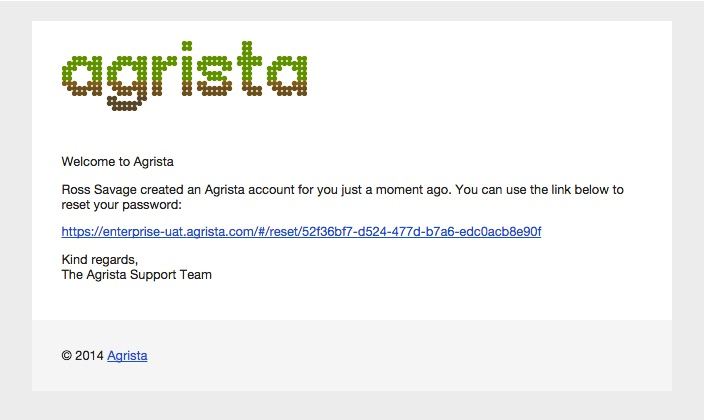

Enter a password twice and click The **Submit** button.

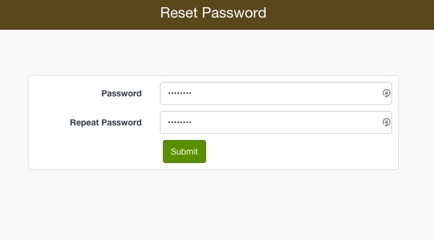

.. note:: If you did not receive an email, check your spam folder for enteprise@agrista.com. Or go straight to https://enterprise.agrista.com/ and use the **Reset Password** button to inititate the same process.

## Download the app

The Enterprise Mobile is designed to help you while you are out in the field. We have ensured that all primary functionality is available offline so that you can sync your tablet and head out for the day.

### System requirements

Enterprise Mobile can be installed on mobile devices running the following operating systems:

* Android: version 4.4 or higher
* iOS: version 6 or higher

It requires permission to access the following:

* Location (GPS)
* Camera
* File storage

### Installing

The Enterprise Mobile app is available from the Google Play Store or Apple App Store.

1. Open your app store
2. Search for 'Agrista'
3. Download and install the app

.. note:: Make sure that you allow for automatic updates so that your tablet always has the latest version of Enterprise Mobile

## Signing in

### Enterprise website

Use the Log In button on the navigation bar to access your company account on Agrista Enterprise.

1. Enter your email address
2. Enter your password
3. Click Sign In

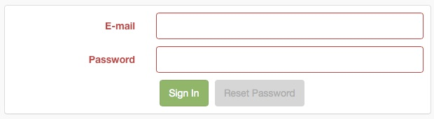

Check out our FAQ section should you have any problems signing in. Or contact us directly for personal assistance.

Once you have successfully signed into Enterprise, you will be shown your Home page. This page displays your personalised Activity Stream, keeping you up-to-date with all your team's activities.

The menu bar on the left of the screen allows to easily navigate around your account.

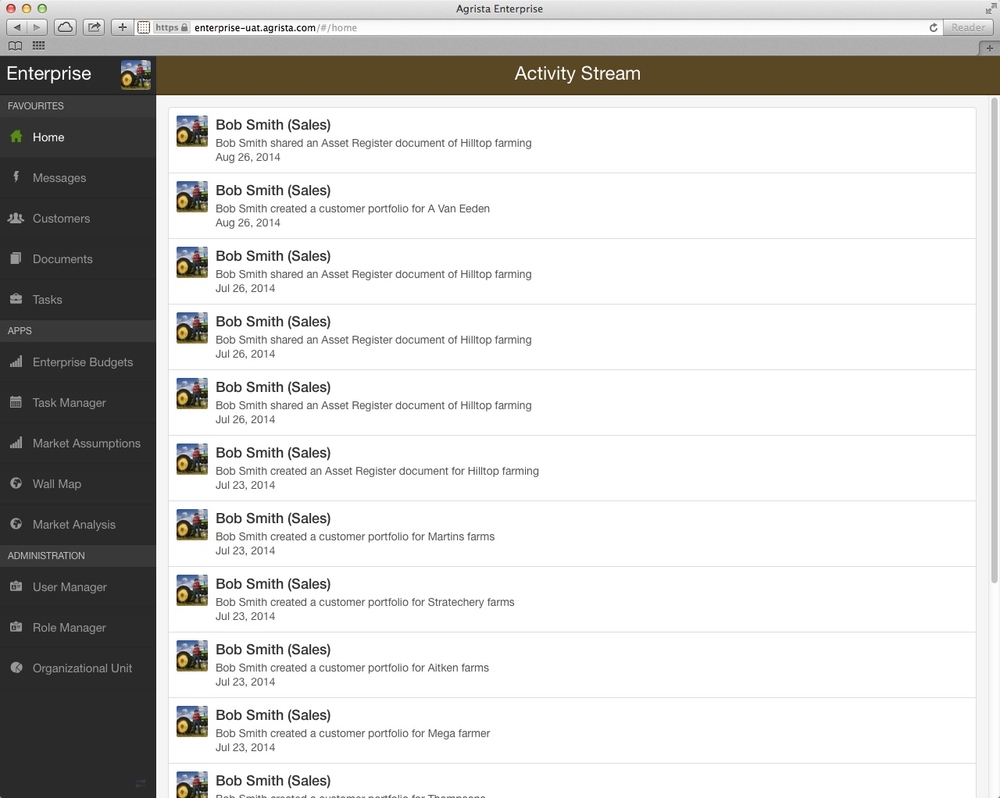

.. note:: Tip: Use the arrow at the bottom of the menu bar to expand or contract the menu

### Enterprise mobile

Clicking on the brown Agrista Enterprise icon on your mobile device will open the login screen shown below. You will need to be registered as a user on your company's Enterprise account before you can log in to Enterprise Mobile with your registered details:

1. Enter your email address
2. Enter your password
3. Click the Sign-In button

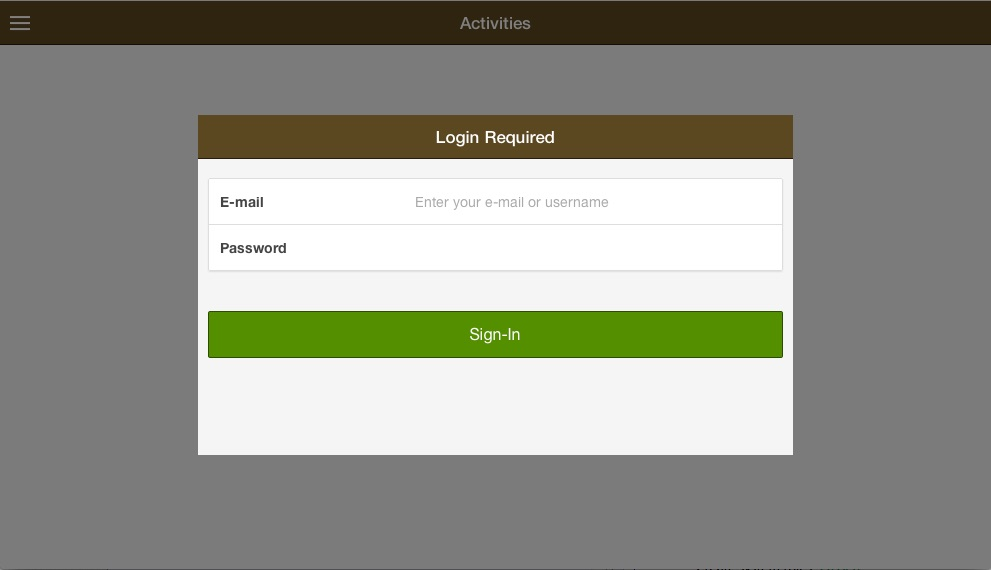

A successful login will open up a blank Home page. You will now have to *sync* your device to download your relevant tasks and customers.

1. On the Home page, drag your finger down the screen
2. Wait until the processing indicator has stopped spinning
3. The Activity Stream will display the latest events

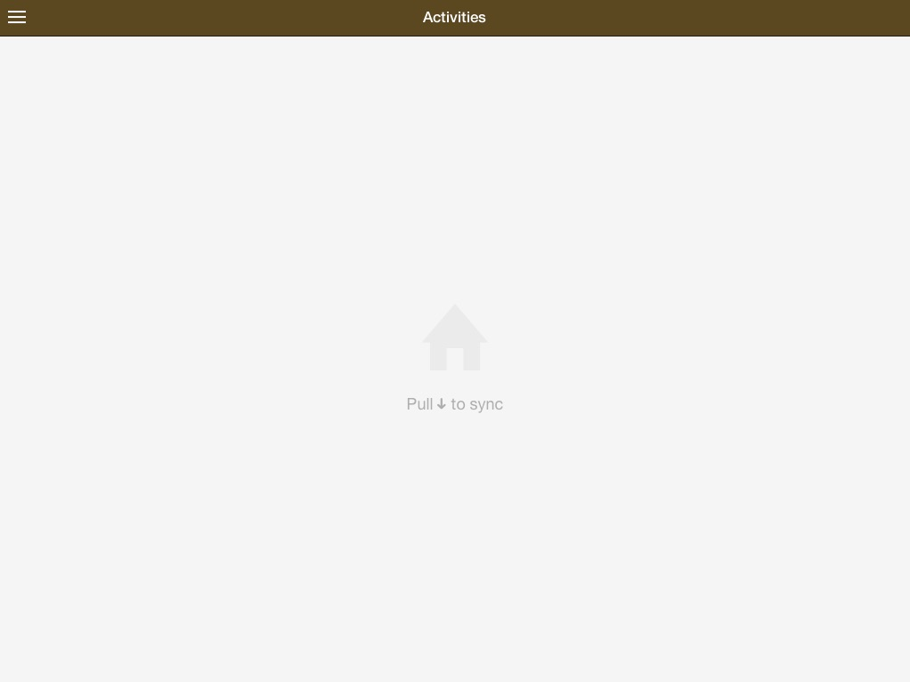

You can return to the Activity Stream at any time by selecting Home from the main menu as shown below

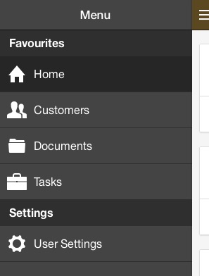

## Your Profile

Your profile details are accessed by clicking on your picture at the top of the main menu.

In your profile you can:

* Upload a profile picture
* Edit your contact details
* Change your password

### Profile picture

1. Click on your profile image on the main menu
2. Click the Edit button
3. Drag and drop a profile picture in the upload box for Photo
4. Click Done to save your changes

### Contact details

1. Click on your profile image on the main menu
2. Click the Edit button
3. The editable fields will become active
4. Click Done to save your changes

### Change password

1. Click on your profile image on the main menu
2. Click the Edit button
3. Enter your current password into Old Password
4. Enter your new password into New Password
5. Enter your new password into Confirm Password
6. Click Done to save your changes

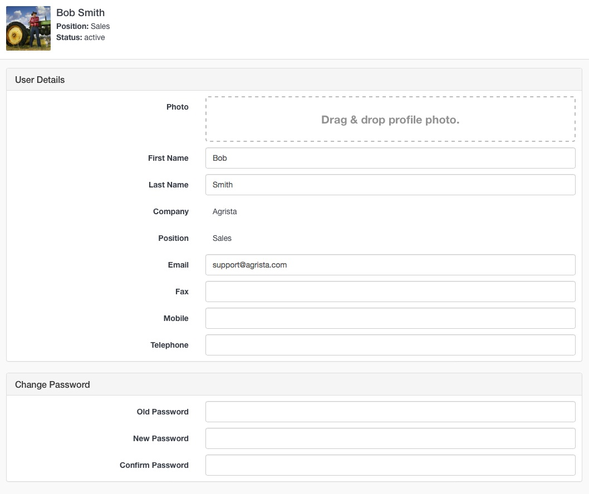

## Logging out

### Enterprise website

The logout button is located in your user profile page.

1. Click on your profile image on the main menu
2. Click the Logout button

### Enterprise mobile

Enterprise Mobile can be left open while you use your mobile device for other activities. There is no need to sign out after every session.

.. warning:: For security purposes signing out of the Enterprise Mobile app will delete all of your locally stored data from your device. Make sure you sync your app before signing out.

Should you wish to sign out, navigate to User Settings on the main menu

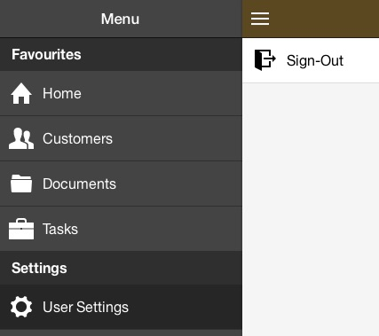

Select *Sign out*

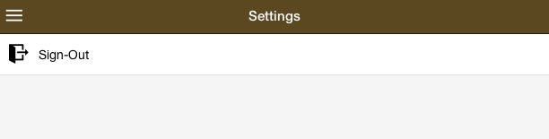

Confirm the data deletion by clicking the Sign out button

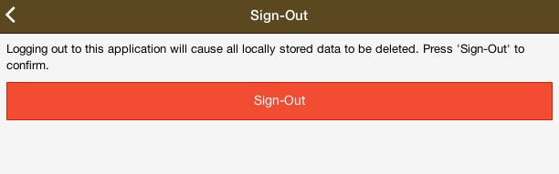
