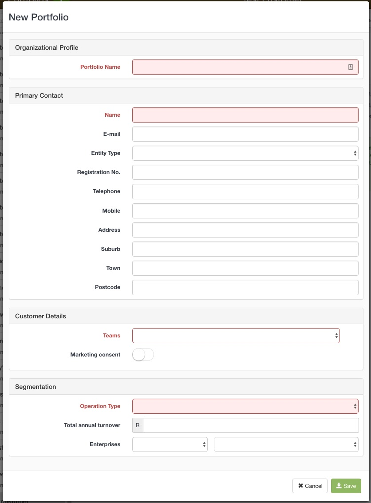
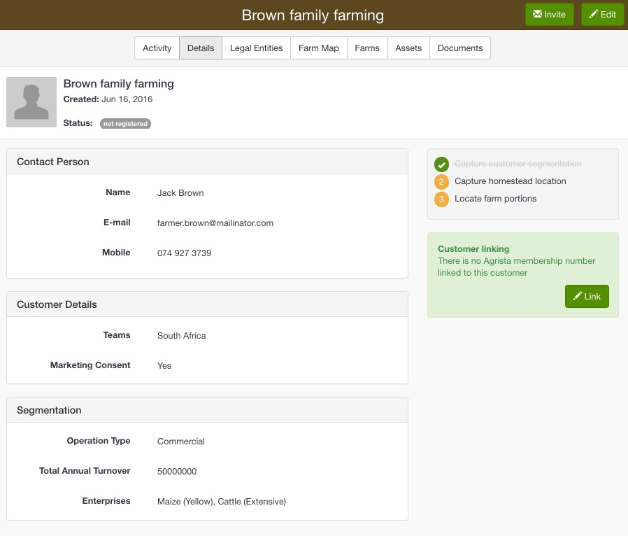
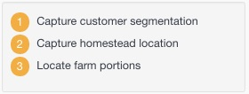
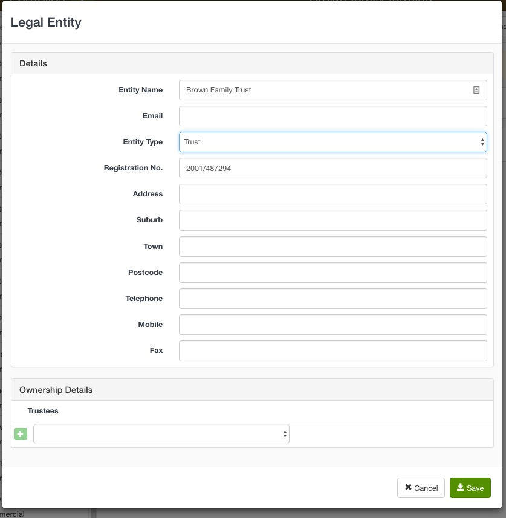
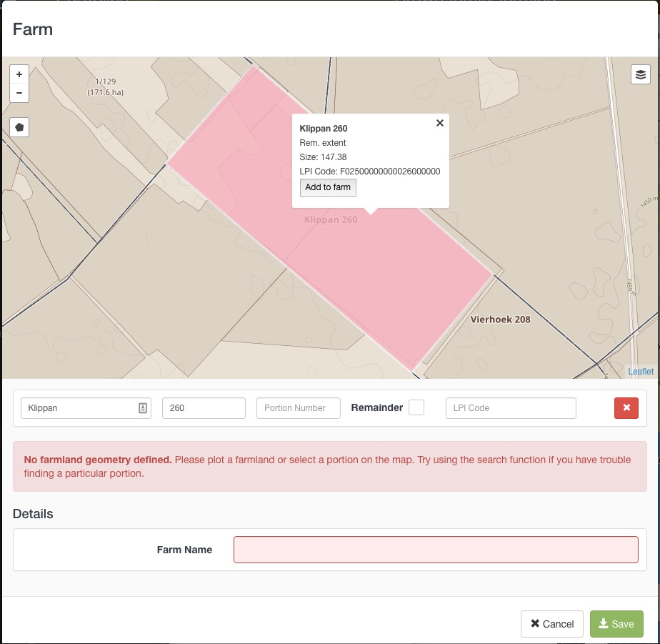
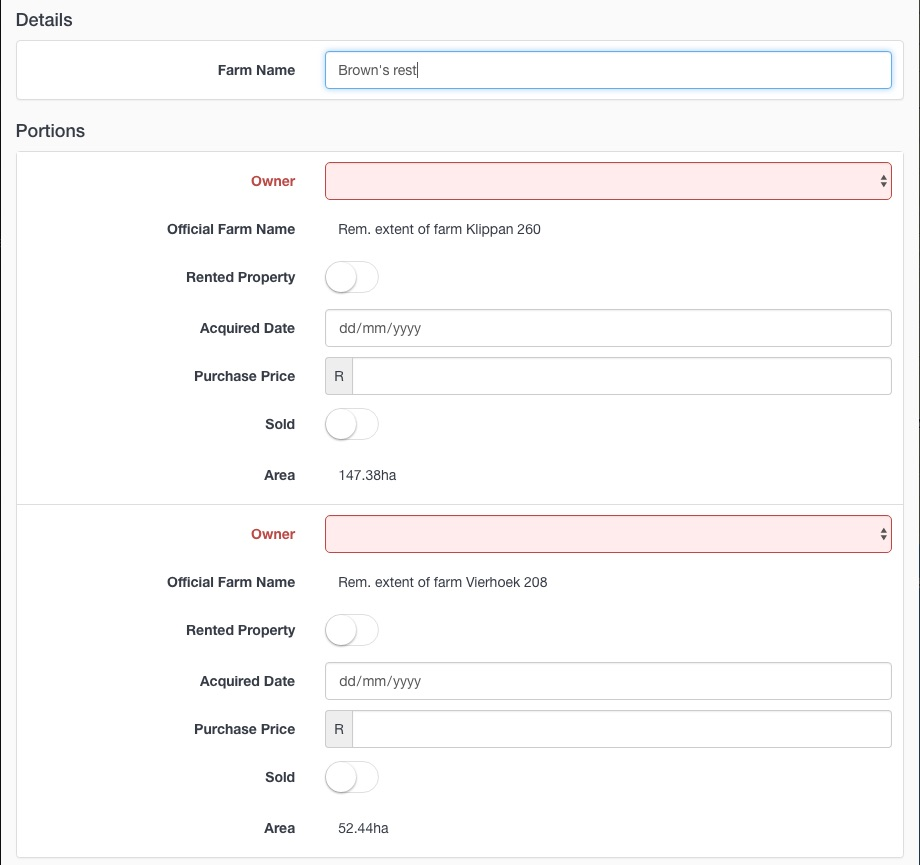
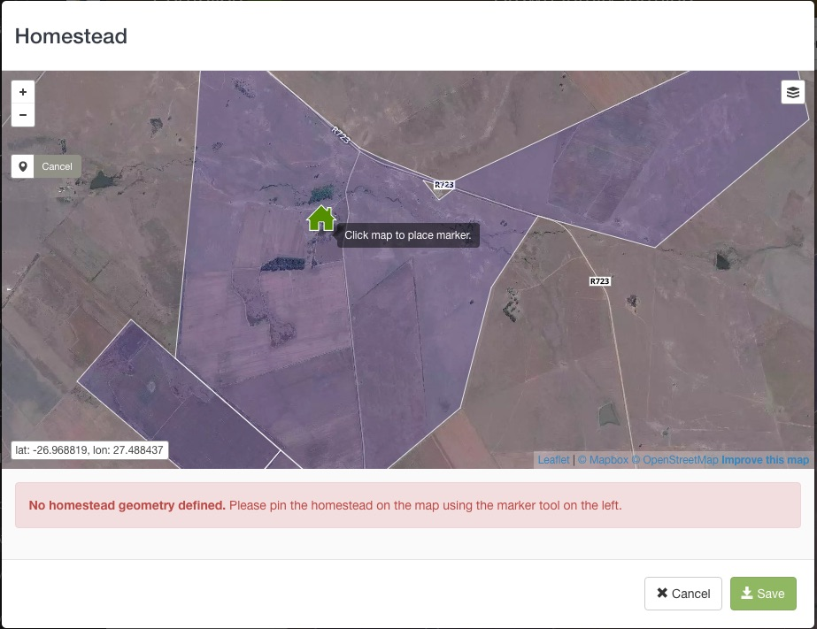
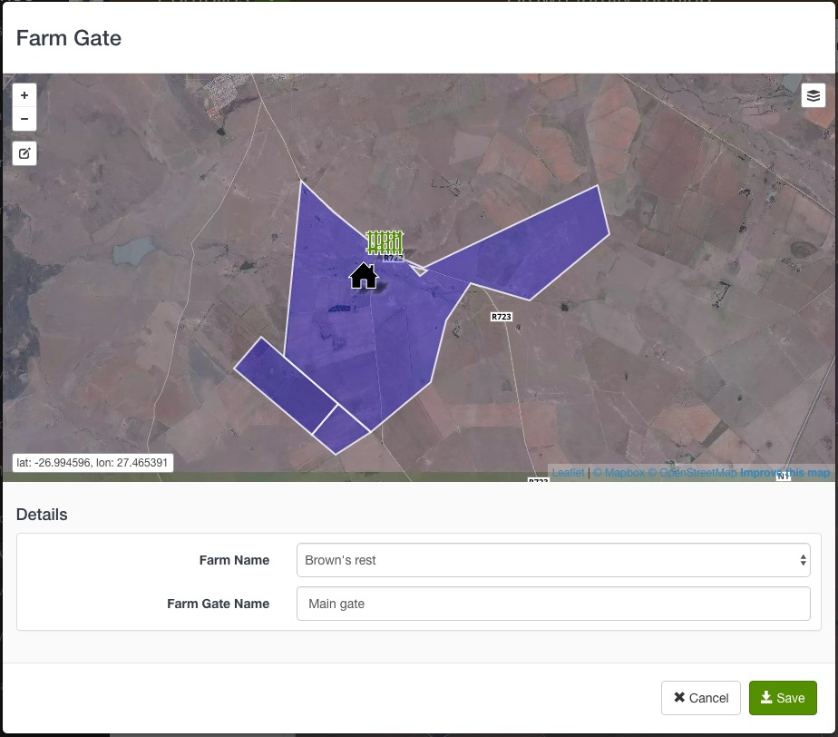

The Customer Portfolio is the central place to which you can add all relevant information about your customer. Each Customer Portfolio provides you with a 360° view of your customer's farming business.

# Adding a new customer

Adding new customers to your Enterprise account is easy. All you need is a name for the customer portfolio, the details of a primary contact, and some basic classification information.

1. Click on Customers on the main menu.
2. Click the Plus (+) button to create a new Customer Portfolio.
3. Fill in the New Portfolio form:
  * Portfolio Name - this should be the names of the collective farming business
  * Primary Contact details - every customer portfolio requires a primary contact, the details added in this section will automatically generate a legal entity for this portfolio
  Customer Details, Teams - used to assign your customers to different divisions without your Enterprise Account, i.e geographically and/or departmental. You can only add customers to teams that your user account is assigned to.
  * Marketing Consent - has the customer given consent to receive marketing material from your company. If this is set to NO, the customer will not be able to be invited to create an Agrista account
  * Segmentation - Classify your customer based on their operation type, annual turnover as well as their farming enterprises
4. Click Save. 

Required fields are highlighted in red

The new customer portfolio will appear in the Customer list.

# Navigating around the customer portfolio

## Customer details

The customer details tab gives you a quick overview of your customer's contact details, classification and farming segmentation.

You can also judge the portfolios level of completeness by seeing if the customer's basic information has been captured. Basic information is required for the customer portfolio to contribute to your company's Management Reports and is defined as follows:

- Capture customer segmentation - management reports can be filtered by farming operation type
- Capture homestead location - the Wall Map feature shows your company's geographic footprint and requires that each portfolio contains a homestead marker
- Locate farm portions - 

------

## Legal entities

The Legal Entities tab on a customer portfolio lists all legal entities involved in the farming business. Farming business can have many different operational fronts, e.g. companies buying and selling products, trading names and private accounts for individuals. All of these different aspects of the farming business can be collected together under the legal entities tab.

The primary contact's details entered when creating a new customer portfolio automatically generated a legal entity.

### Add a legal entity

1. Select the Legal Entities tab on the customer portfolio.
2. Click the Add Entity button in the top right corner.
3. Fill in the Legal Entity form, as a minimum we recommend you capture the following:
  * Entity name - the official legal name
  * Entity Type - select the entity type from the drop down list
  * Registration No. - the official legal number associated with this entity
4. Click Save.

Relationships between legal entities can be captured in the **Ownership Details** section at the bottom of the Legal Entity form. For example, link the shareholders to a Private Company, or list the member of a cooperative. The Ownership Details section appears when you select the Entity Type.

-------

## Farm Map

A farm is the geographical region within which a customer uses for the purpose of agricultural production. The Agrista farm map contains multiple background options:

* Agriculture: displaying cadastral farmland boundaries
* Satellite: satellite imagery
* Hybrid: satellite imagery with a farmland boundaries overlay
* Light: a light grey agricultural background
* Production Regions: displaying homogeneous production areas

### Add a farm

Farms can be added a single portions or groups of portions that are farmed as a unit.

1. Select the Farm Map tab on the customer portfolio.
2. Click the Add button in the top right corner and select Farm from the list.
3. Finding your customer's farm can be done in 3 ways:
  - Use the search bar, under the map, if you know the official farm name, number and/or portion number. The map will zoom to any search results and you can select portions by clicking on them.
  - On the map, zoom in to the appropriate place and highlight the relevant portion(s) by clicking on the map.
  - Alternatively, use the polygon tool on the map to draw the farm boundaries manually.

4. Fill in the farm name (this can be the local name used by the farmer) and assign a legal entity to each portion 
5. Click Save.

The farm will display on your map.

### Add a homestead

A homestead pin shows the location of the primary dwelling

1. To add a homestead pin, click the Farm Map tab on the Customer panel.
2. Click Add and select Homestead.
3. On the map, click the Pin and place the house icon in the appropriate location.
4. Click Done.

### Add a farm gate

1. To add a farm gate, click the Farm Map tab on the Customer panel.
2. Click Add and select Farm Gate.
3. On the map, click the Pin and place the gate icon in the appropriate location.
4. Assign the gate to a farm and give it a name.
5. Click Done.

