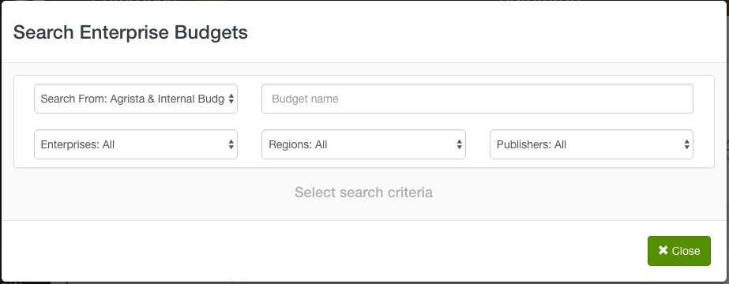
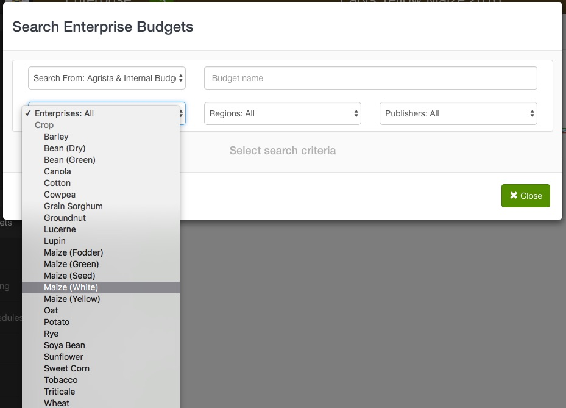
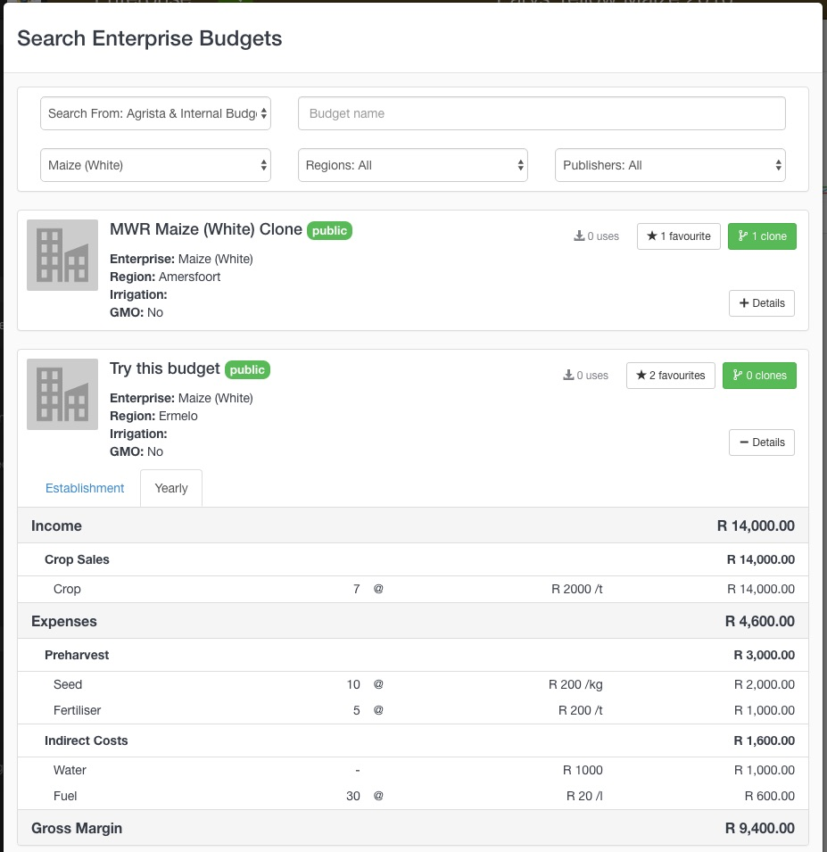
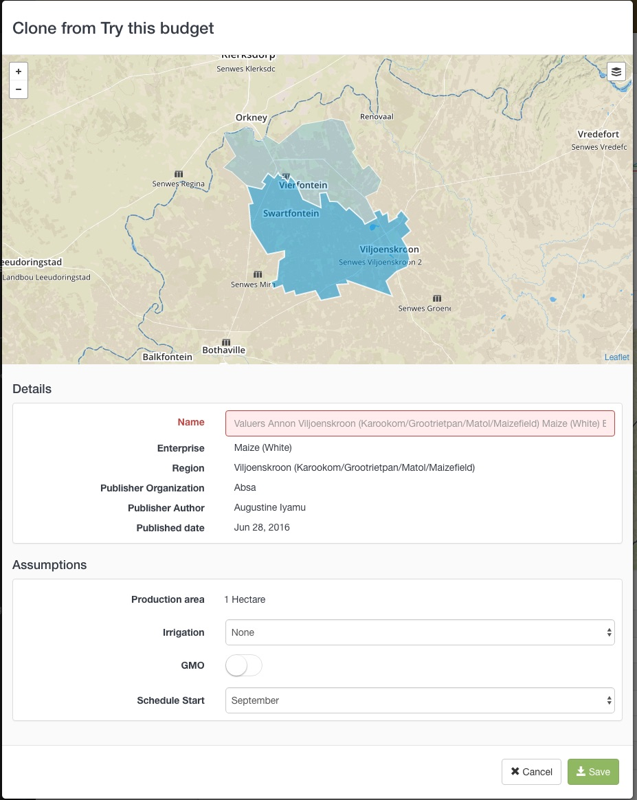
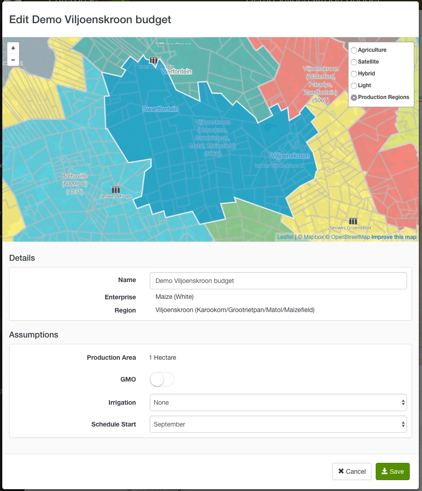
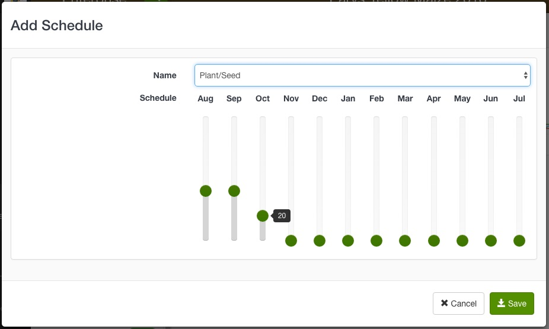
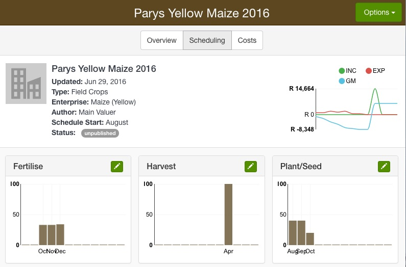
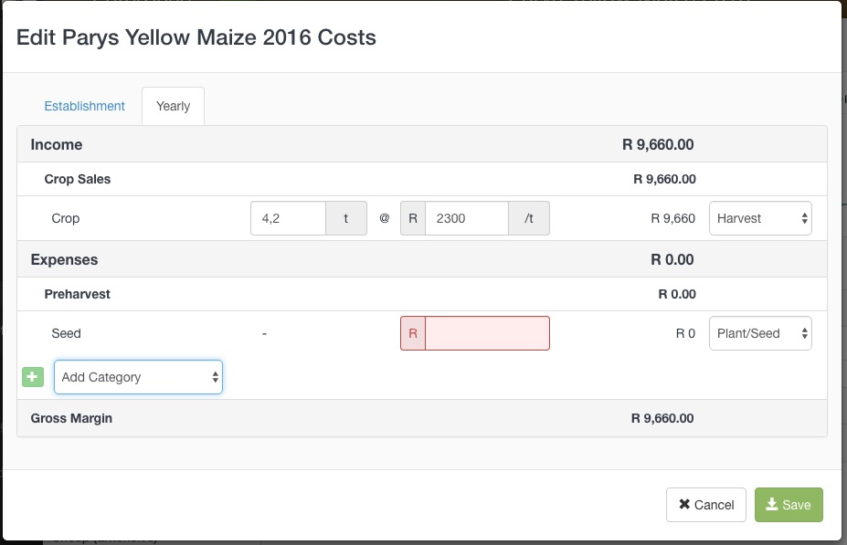

To forecast production income and expenses you will need to prepare a budget for each commodity your customer is producing. Budgets must be downloaded into your Agrista account for you to use them in a FRP. To prepare budgets you need to navigate to the **Enterprise Budgets** option in your Agrista account. A list of your existing budgets will display. 

## Search for a budget

To add budgets to your list you can browse existing budgets and download them. You can then use a budget as-is or make a copy that you can modify.

### Browse published budgets

1. Click the Browse button at the top of your budget list. This opens a modal with search filters for enterprise, region and publisher.

2. Use the Enterprises drop down list to filter for commodity. A list of matching budgets will appear.

3. View a budget's details by clicking on the **Details** button. The budget card will expand to display the associated income and expenses. Click on the Details button again to contract the card.

4. Add a budget to your list by clicking the **Favourite** button and continue to browse.

-------

## Customise a budget

Published Enterprise budgets can be cloned to create copies. You can then customise the budget and use it in your FRP.
Clone a **Blueprint** budget to start capturing an enterprise budget from scratch.

1. Select a published budget from your Enterprise Budget list
2. Click the Options button and choose Clone
3. Give the budget a name and click Save

### Editing budget assumptions

The budget's assumptions define the following:

- the region in which the budget is applicable
- the start of the production cycle
- for crops and horticulture; irrigation type if any
- for livestock; grazing density and herd size

1. Select an unpublished budget from your Enterprise Budget list
2. On the Overview tab, click the **Options** button and select **Edit Details**

- To change the budget's applicable region, click on the map in the region you require. It may be helpful to switch the map backdrop to the Production Regions layer. 
- To change the start of the production cycle select the required month from the **Schedule Start** drop down list
- To change the irrigation select the required type from the **Irrigation** drop down list

### Editing schedules

Schedules specify when a cost occurs. For instance if a crop budget starts in August, the costs associated with planting seed may occur from August to October. The Plant/Seed schedule can be set up to distribute these costs across the 3 months.

To create a new schedule:

1. On the Scheduling tab, click the **Options** button and select **Add Schedule**. The Add Schedule modal will open up.
2. Select a schedule action from the name drop down list and adjust the monthly sliders to allocate the costs associated with that action. When the cost allocation reaches 100% the Save button will activate.
3. Click Save

To edit an existing schedule:

1. On the Scheduling tab, click the edit icon on the existing schedule.
2. Modify the cost allocation.
3. Click Save

### Editing production income and expenses

Income and expenses are estimated per the budget's assumptions, i.e. costs per ha for crops, or costs per herd (based on the herd size assumptions). 

1. On the Costs tab, click the **Options** button and select **Edit Costs**
2. Use the **Add Category** drop down list to add income and expense categories to the budget.
3. Capture the costs and allocate them to a scheduled action.
4. Click Save

---
Frequently Asked Questions:

*I cloned a budget with unit costs on the expense categories, how do I get rid of them?*

1. Place your cursor over the expense you wish to edit
2. Click the red delete icon that appears next to the category name
3. Re-add the category using the Add Category drop down list