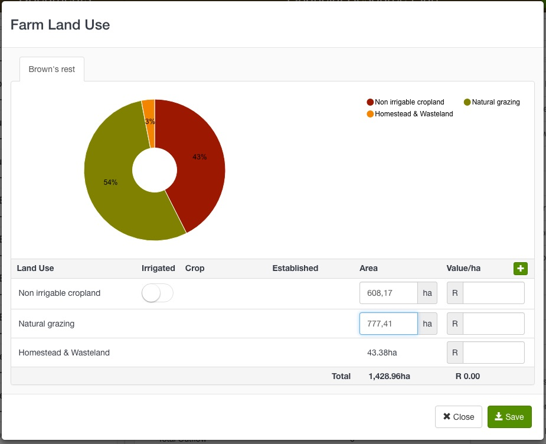
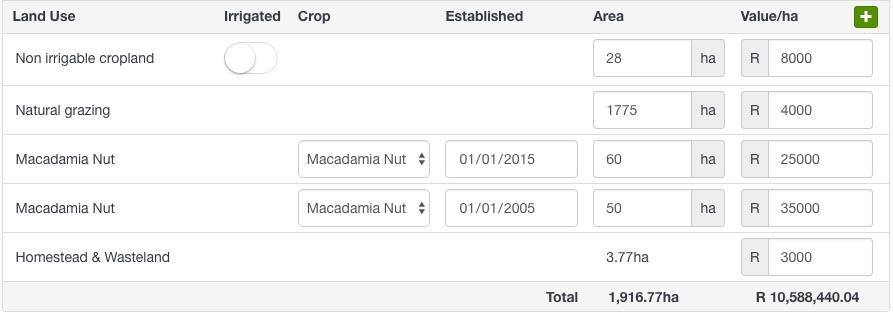
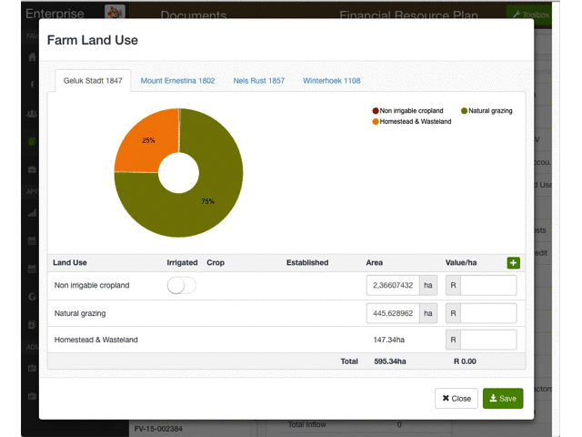

## Define land use

We developed this useful tool for easily capturing the value of the customer's farmland. It also generates the land assets that are needed for production planning.
This only needs to be done once per customer and will pull through to each subsequent FRP document.

#### Allocate Farm Land Use

1. Select **Allocate Farm Land Use** from the Toolbox menu.

  The Farm Land Use modal will open and automatically classify the customer's farm's into general land use categories based on satellite imagery.

To modify this auto-classification click the **Plus** button in the header line of the Land Use table. A list of land categories will open.

#### Add land value

1. Add a value/ha for each land use category. The total farmland value will be displayed.

---

##### Notes

The structure of the customer's farm data will affect how this tool displays the Land Use categories. For instance:

- Multiple farms are displayed in different tabs

<!---
- Existing land use classifications will pull through from the customer portfolio
-->
