Compiling a farm valuation report requires the completion of a few tasks. Each task can be edited to capture or updated the required information. Once a task is finished it can be marked as **Complete** and will be removed from your task list.

## Attach title deed

1. Select the Attach Title Deeds task and click Edit
2. Capture a property description
3. Complete the Attach Title Deeds task by dragging and dropping a file into the attachment space
4. Select the Done button

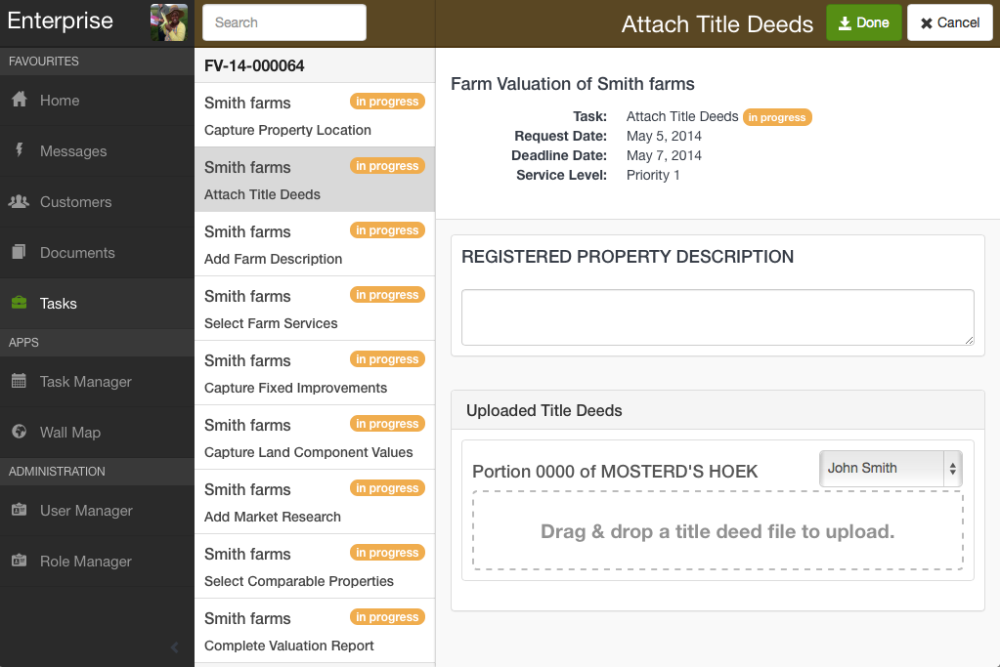

5. Click Complete. The task cannot be edited further.

## Add farm description

1. Select Add Farm Description task and click Edit
2. Complete the Add Farm Description task and add attachments if desired
3. Select the Done button

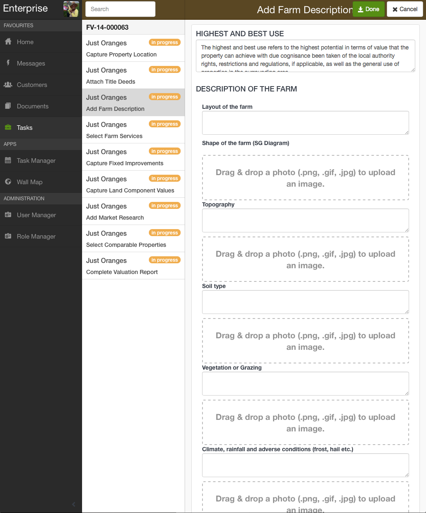

4. Click Complete. The task cannot be edited further.

## Edit farm services

1. Choose the Select Farm Services task and click Edit
2. Edit farm services details and add attachments if applicable
3. Select the Done button

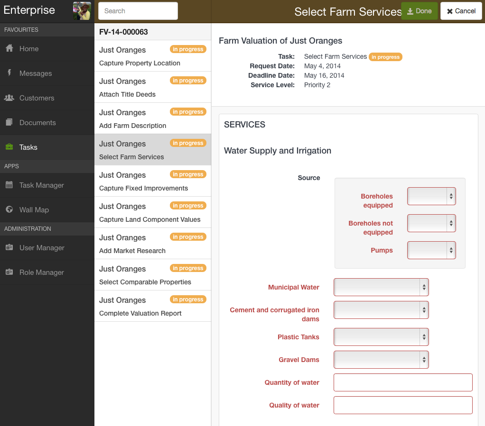

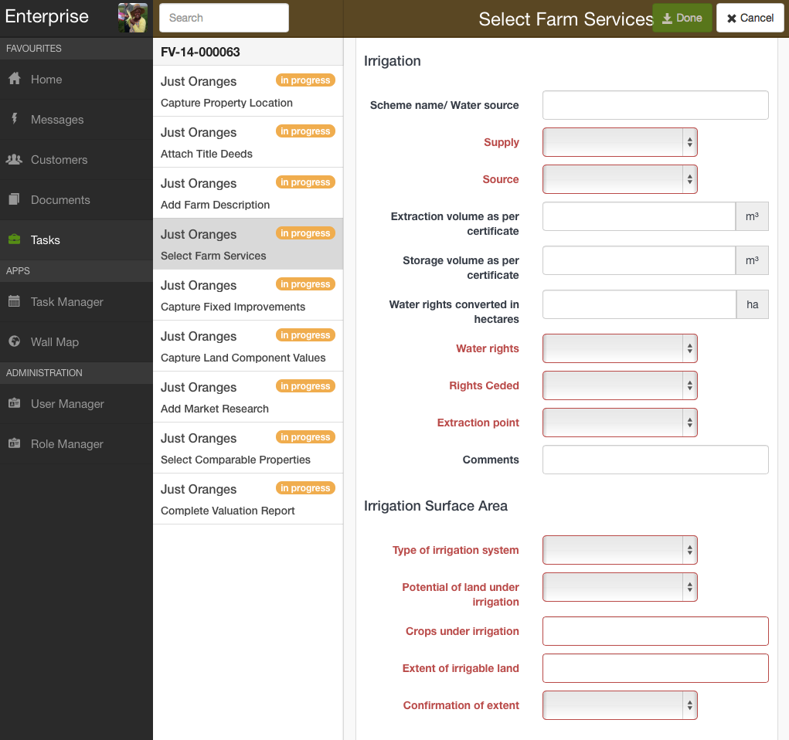

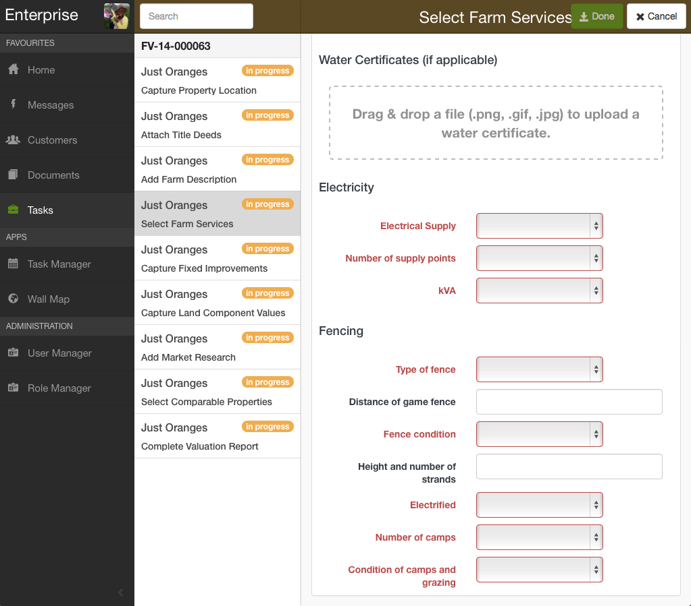

4. Click Complete. The task cannot be edited further.

## Capture fixed improvements

	Fixed improvements are pulled through from the customer portfolio. Return to the Customer to add additional fixed improvements if necessary.

1.	Select the Capture Fixed Improvements task and click Edit
2.	Perform necessary edits and then click Done.

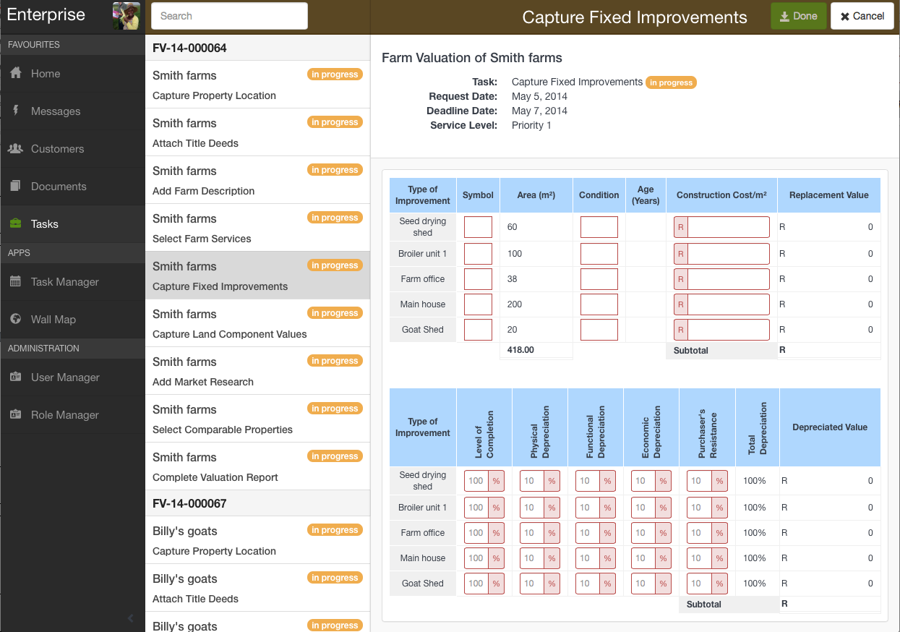

3. Click Complete. The task cannot be edited further.

## Capture land component values

	Land assets are pulled through from the customer portfolio. Navigate to the Customer to add fields to define the land use and add cropland, pasture and permanent crop assets.

1. Select the Capture Land Component Values task and click Edit
2. Perform necessary edits and then click Done

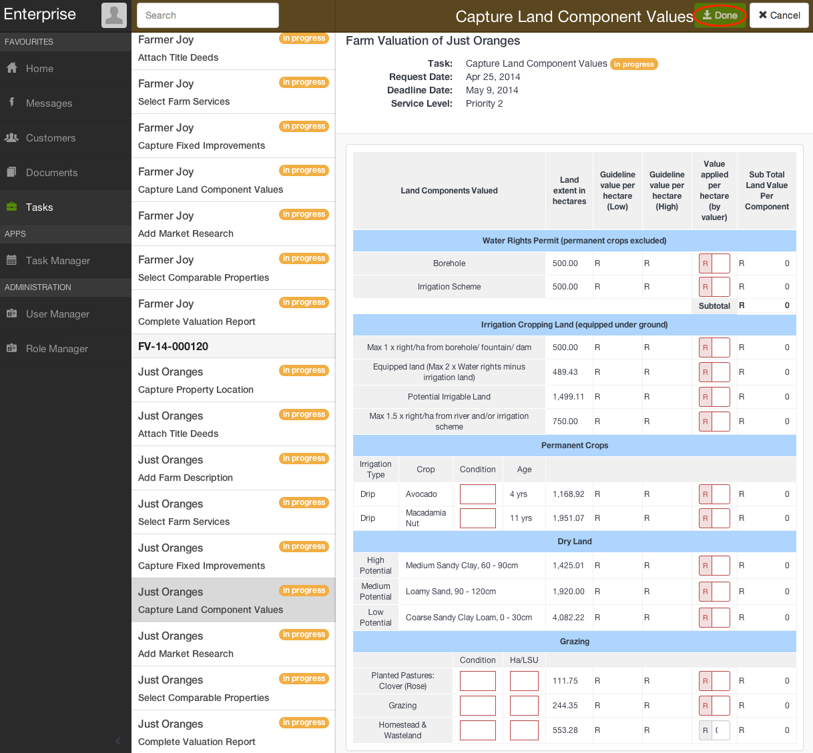

3. Click Complete. The task cannot be edited further.

## Add market research

1. Select the Add Market Research task and click Edit
2. Enter market research information, attach related images, and add additional headings and sections if needed

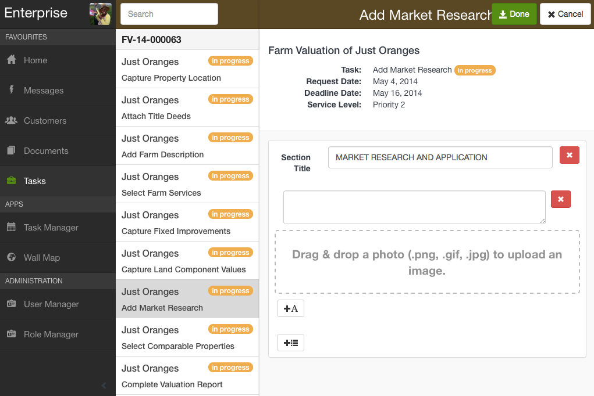

3. Click Complete. The task cannot be edited further.

## Select comparable properties

1. Choose the Select Comparable Properties task and click Add
2. From the map, select the appropriate comparable property and add any necessary information. When finished, click Save. Choose Add again to input more comparable properties

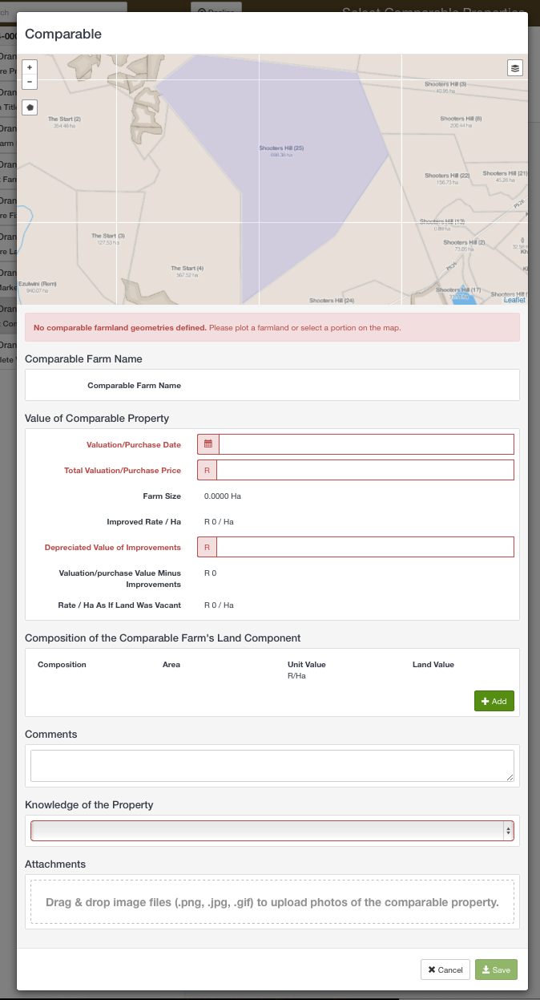

3. To edit any of the properties, simply click on the property card and select Edit
4. Choose Done when finished

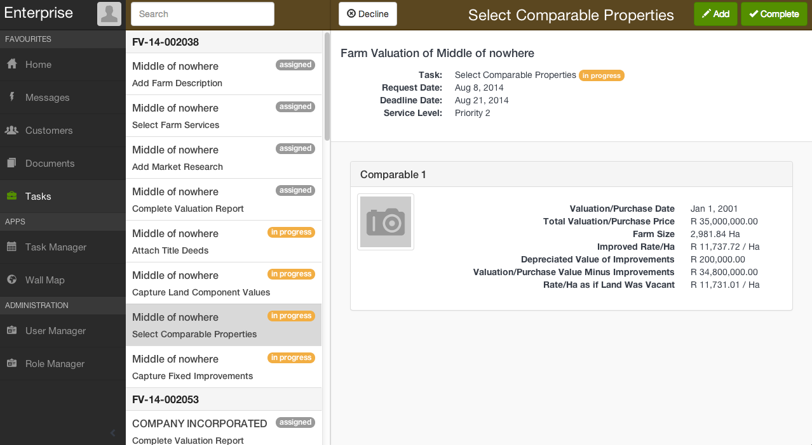

5.	Click Complete after entering all desired comparable properties. The task cannot be edited further. 

## Attach invoice

1. Select the Attach Invoice task and click Edit
2. The details needed for you to generate your invoice are displayed in the task
3. Attach an invoice by dragging and dropping a file into the attachment space
4. Select the Done button

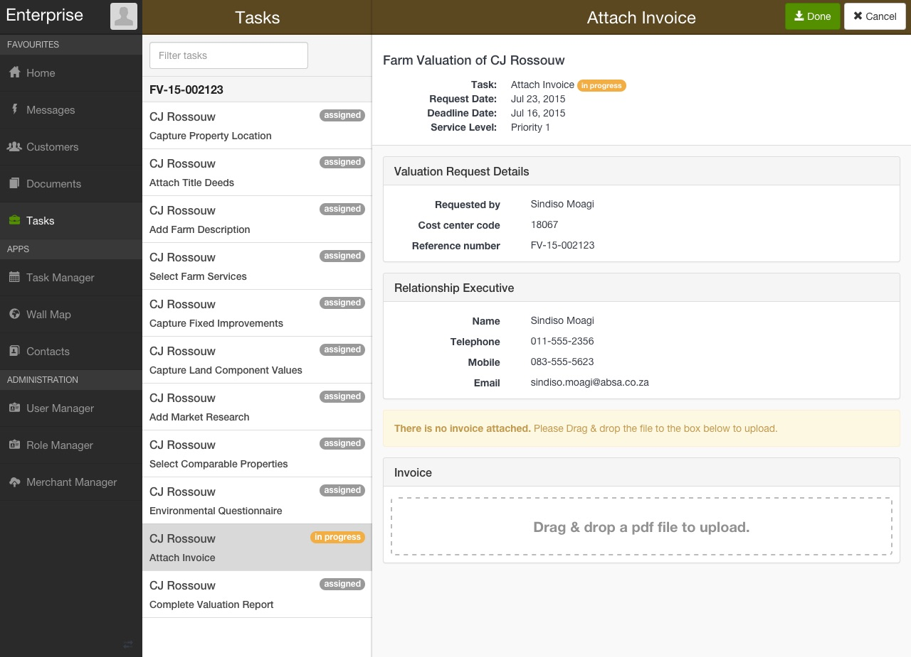

5. Click Complete. The task cannot be edited further.

## Complete valuation report

1. Select the Complete Valuation Report task
2. Add information about the Valuation Method
3. Complete the Conditions of Valuation with Source of Information, Conditions of Valuation, and from the drop-down menu, Land Claims

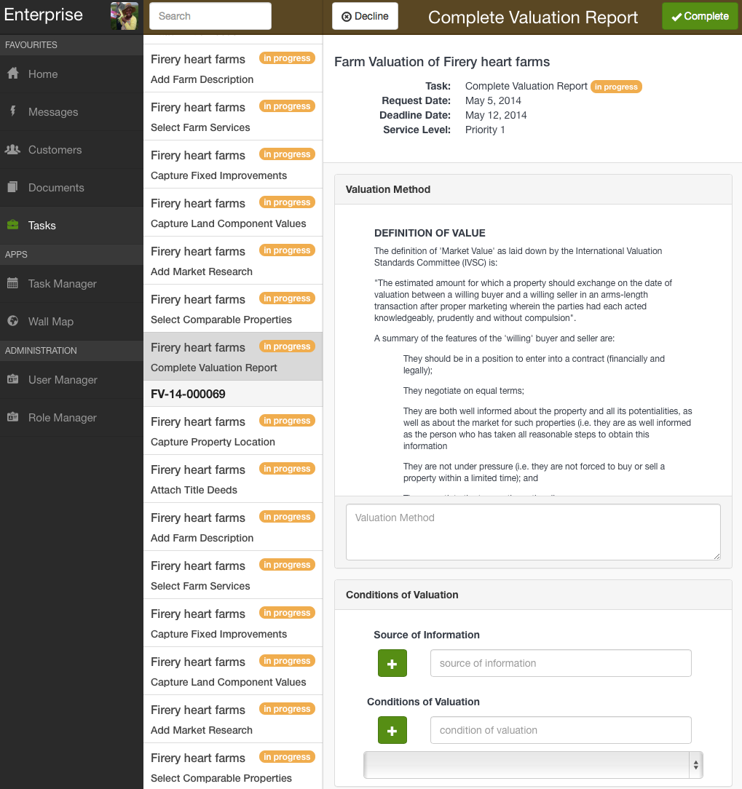

4. Sign the document in the Declaration of Valuation section.

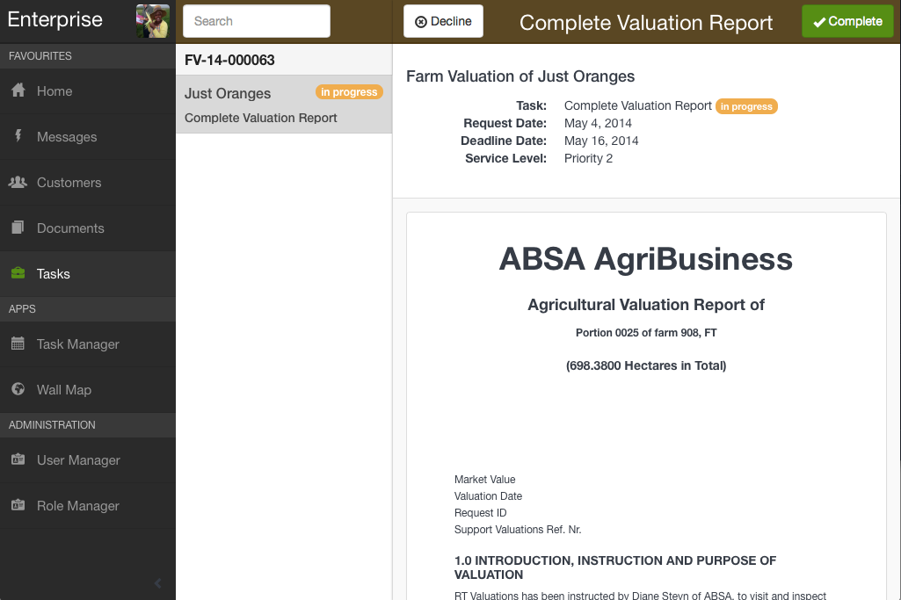

5. Click the Save button. 