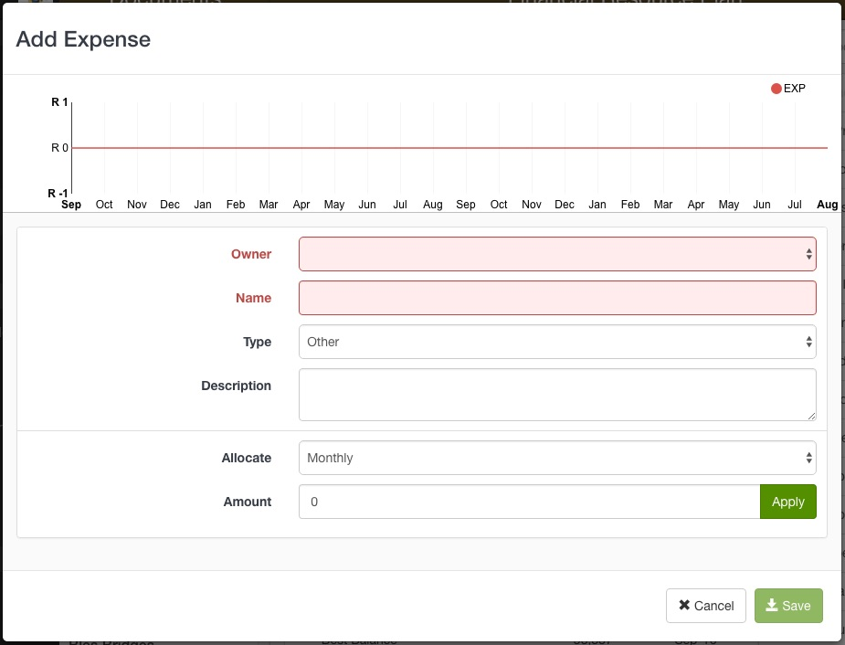
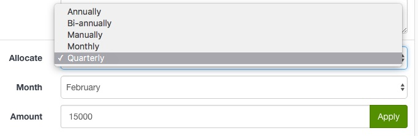
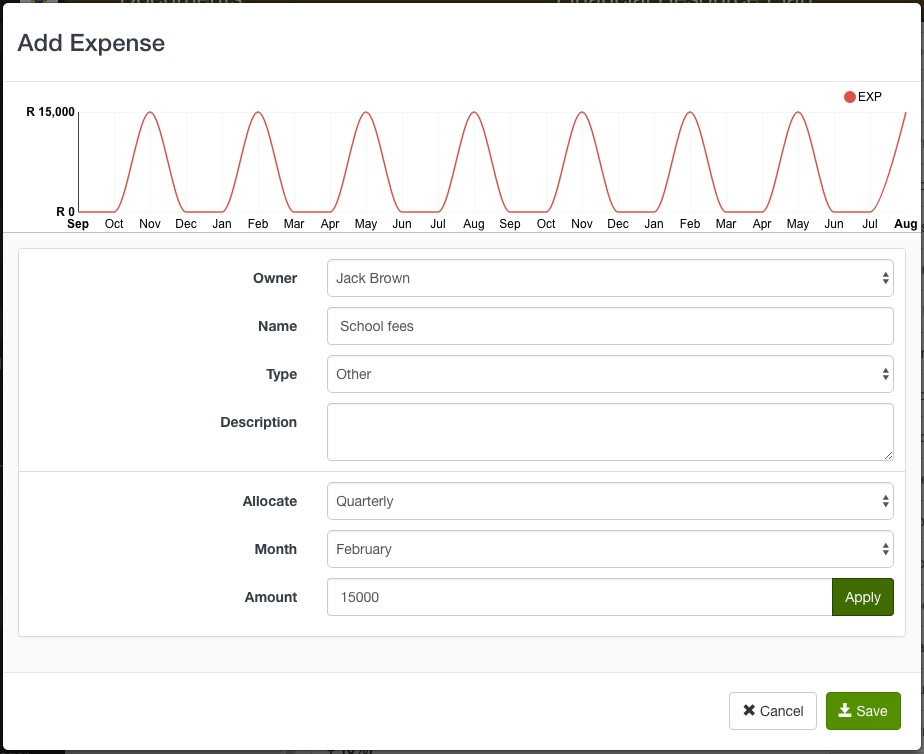
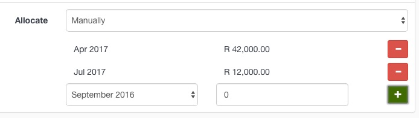
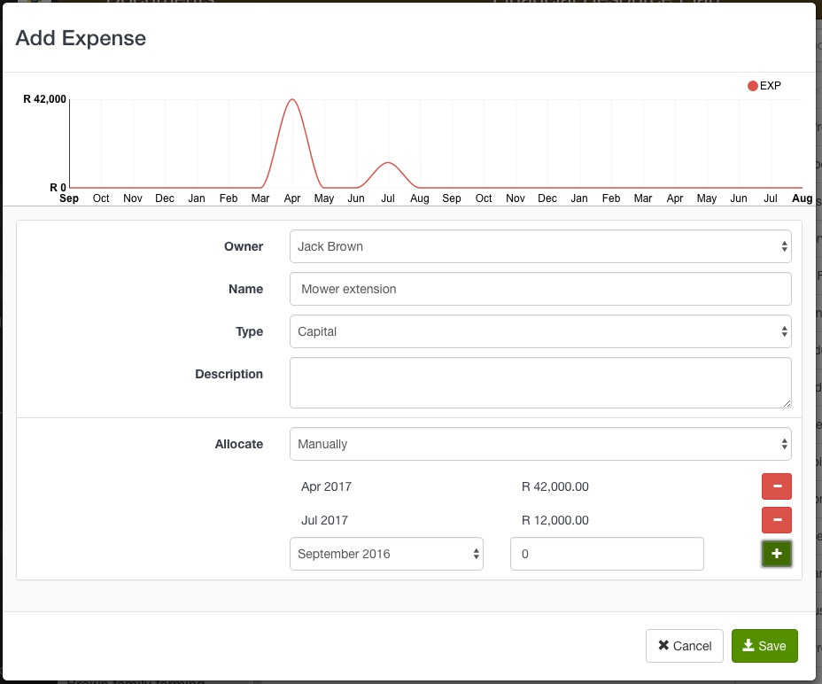
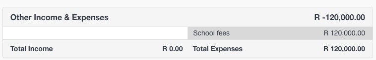

Capture the customer's additional expenses with the **Add Expense** option from the Tool box.

1. Select **Add Expense** and the Add Expense form will open in a modal
2. Fill in the Expense details
  - Owner - a drop down list of the active legal entities in the customer portfolio
  - Name - this is displayed in the Income & Expenses table
  - Type - Select either Capital, Other or Production
  - Description - differentiate between similar expenses by adding a description

#### Specify when the expense occurs:
**Reoccurring costs**
1. Select either *Annually*, *Bi-annually*, *Quarterly*, *Monthly*. 
2. Specify the payment month and expense amount 
3. Click **Apply**

The graph will update to reflect the expense data

**Irregular costs** 
1. Select *Manually* from the Allocation drop down list. 
2. Select the month of the cost and fill in the amount. 
3. Click the **Plus** button to add the cost to the expense data.

The graph will update to reflect the expense data

4. Click **Save**

------

### Editing Expense data

To make changes to an existing Expense, click on the Expense name in the Income & Expenses table. 

The expense form will open in edit-mode. Make your changes and click **Save**