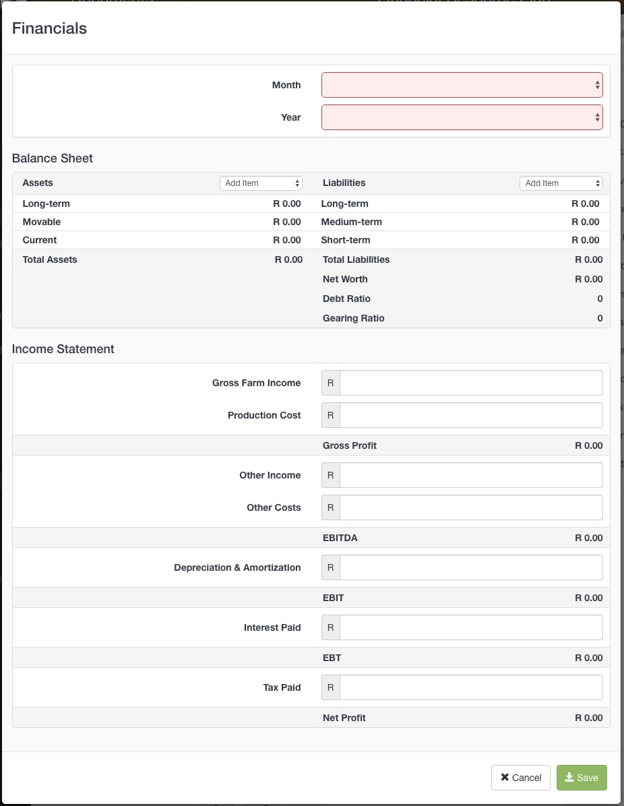
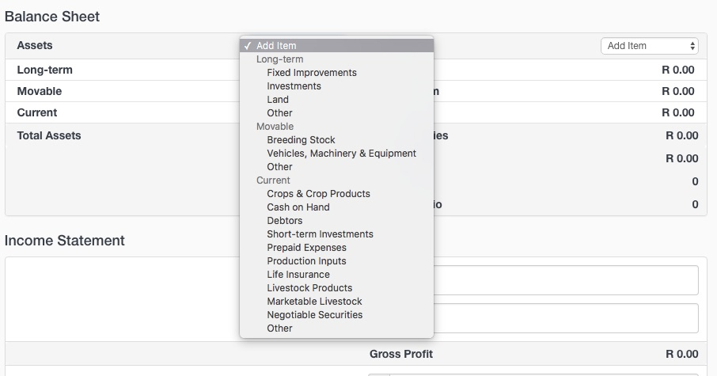

Add audited financials to the Balance Sheet and Income statement tables of the Financial Resource Plan. Add any audited financials accrued during the past 10 years. 

1. Click on the Toolbox and select **Add Financials**
2. Use the drop down lists to specify the *Month* and *Year* of the financials.

3. Add Assets and Liabilities to the Balance sheet table by selecting categories from the *Add Item* drop down list.

4. Add information to the Income Statement table.
5. Click Save

The system will automatically display the three latest years of captured data.

