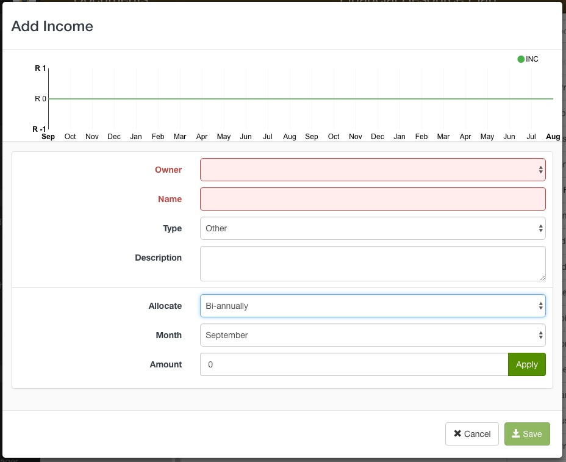
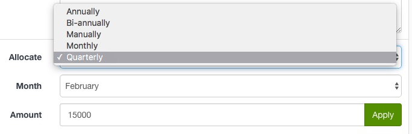
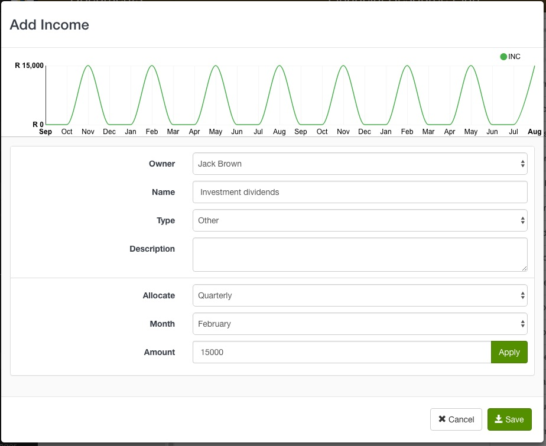
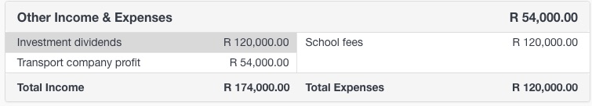

Capture the customer's additional sources of income with the **Add Income** option from the Tool box.

1. Select **Add Income** and the Add Income form will open in a modal
2. Fill in the income details
  - Owner - a drop down list of the active legal entities in the customer portfolio
  - Name - this is displayed in the Income & Expenses table
  - Type - Select either Capital, Other or Production
  - Description - differentiate between similar sources of income by adding a description

#### Specify when the income occurs:
**Reoccurring income**
1. Select either *Annually*, *Bi-annually*, *Quarterly*, *Monthly*. 
2. Specify the receiving month and income amount 
3. Click **Apply**

The graph will update to reflect the income data

**Irregular income** 
1. Select *Manually* from the Allocation drop down list. 
2. Select the month the income is received and fill in the amount. 
3. Click the **Plus** button to add the amount to the income data.

The graph will update to reflect the income data

4. Click **Save**

------

### Editing income data

To make changes to an existing income, click on the income name in the Income & Expenses table. 

The income form will open in edit-mode. Make your changes and click **Save**