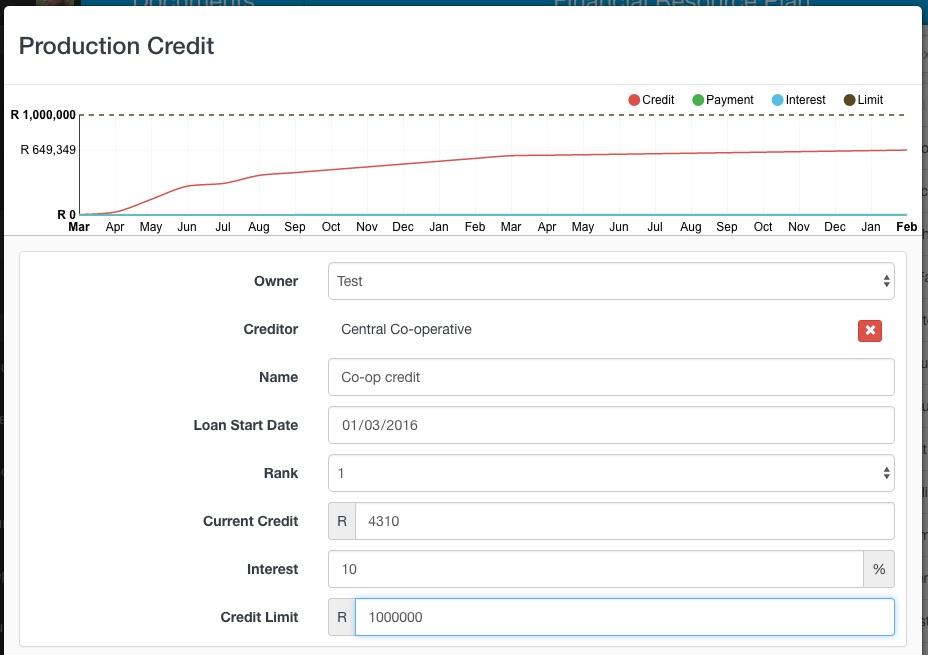
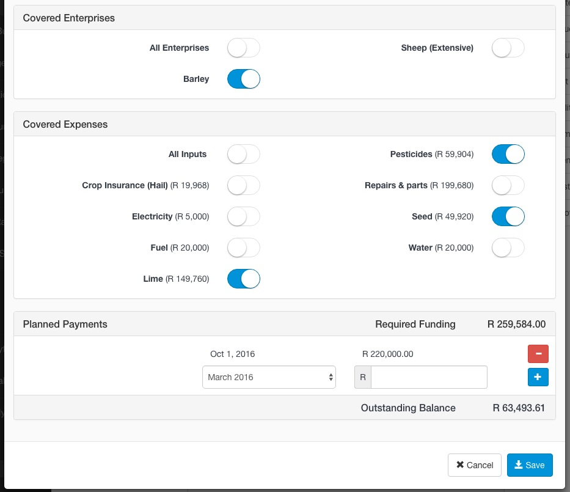

## Add Production Credit

Capture all sources of production credit available to the customer.

1. Select **Edit Production Credit** from the Toolbox menu. The system will automatically list the expenses created in the previous step.
2. Enter in the details of the credit provider. If the credit provider you need is not in the Creditor drop down list, please send an email to support@agrista.com.
3. Use the **Covered Enterprises** section to filter the expenses by enterprise. This is useful when capturing expenses covered by an off-taker for a particular crop.
4. Use the **Covered Expenses** section to specify which expenses are covered by this creditor. 

- Note that although the required funding may be more than the set credit limit, the system will not cover any additional expenses once the credit limit has been reached. Each expense has a date associated with it and expenses occurring first will be allocated to the creditor first.
4. Add any planned repayments, including the value and date of crop payments. Click the plus button on the repayment for it to be saved. To edit a repayment, use the red delete icon to remove it then recapture the correct information.
5. Click Save

