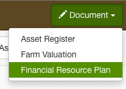
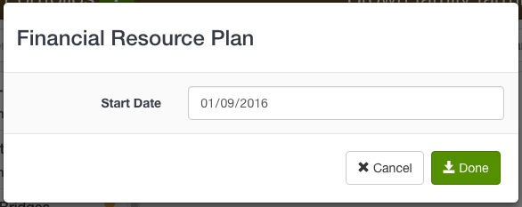
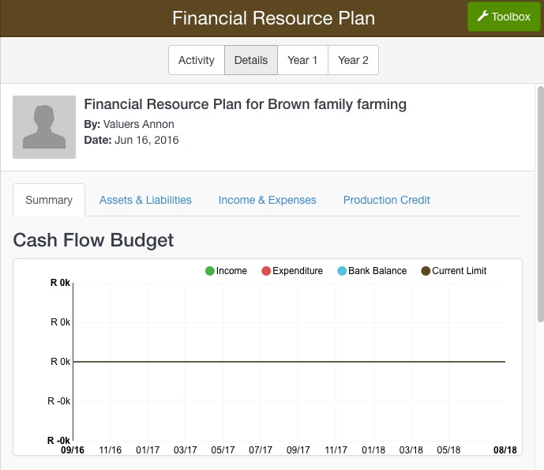
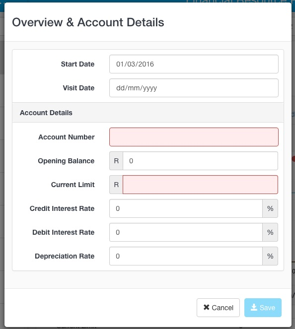
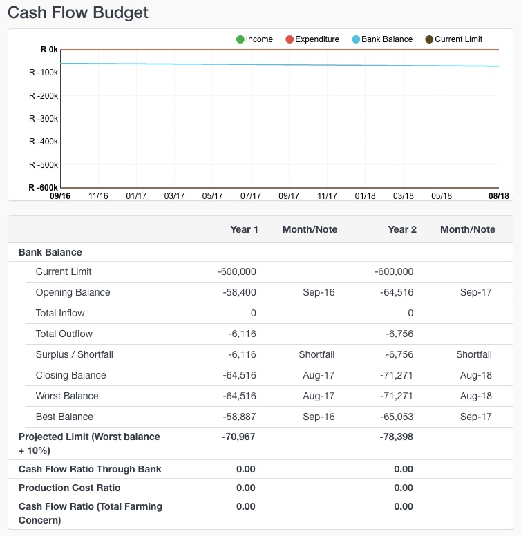

1. Go to Customers
2. Navigate to your customer's Documents tab 
3. Click the **Document** button and select **Financial Resource Plan**

The Financial Resource Plan modal will open which requires a start date. The Start Date marks the beginning of the 2-year financial plan and will automatically be the date at which all opening balances must be captured.

4. Enter the start date of the FRP 
5. Click the **Done** button

The new Financial Resource Plan document will open on the Details page

Data can be entered into the FRP via the **Toolbox** button. 

## Enter current account details

If the customer has an existing credit account with your company, you can capture these details as follows:

1. Click the **Toolbox** button in the top right corner of the page.
2. Click on the **Edit Overview & Account Details** option

This opens the **Overview & Account Details** modal, shown below, where you can capture the customer's account number, opening balance, current limit, interest rates and depreciation rate. You can also enter the date of the farm visit and modify the start date of the FRP.

Click **Save** to return to the FRP. 

The Cash Flow Budget graph and table will update to reflect the information you have just entered.

