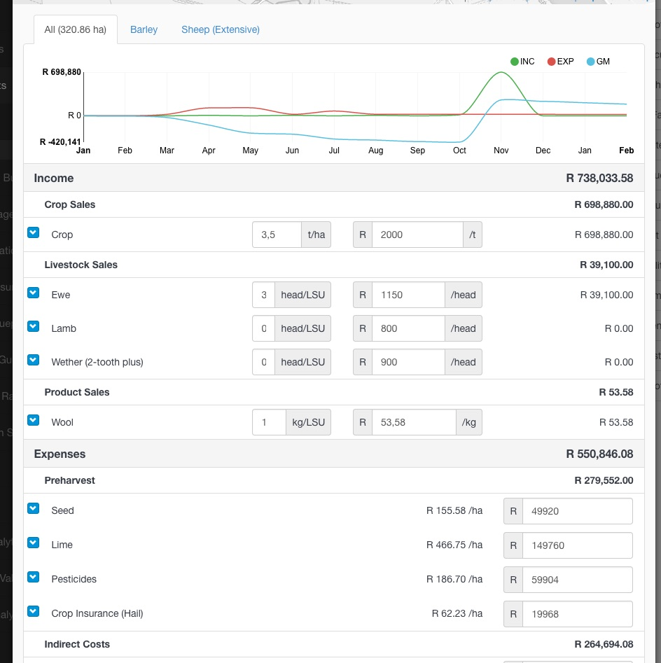

Total expenditure on production expenses can vary from the per hectare budget assumptions. The **Edit Production Costs** tool opens a production cost summary which can be edited to reflect actual expenses.
Indirect production costs, such as fuel, water, electricity etc., can also be added to the production cost summary.

1. Select **Edit Production Costs** from the Toolbox menu. The system will automatically list the expenses from the budgets you assigned to land components. The budget's costs per hectare are multiplied by the applied area in the Define Enterprises modal.
2. Click the Edit button to open the production costs for editing. Use the tabs to switch between the different enterprises, or make edits to the sum of enterprises on the All tab.
3. Add addition indirect expense categories using the Add Category drop down list.
4. Click Save

