The Market Analysis tool provides a tool to analyse market share and product demand among various geographic regions. Data from customer portfolios is combined with regional enterprise budgets, land use data gathered from satellite imagery, and a few basic assumptions about local farming practices to generate an interactive map. The map shows what and how much farmers in the region are spending and producing, as well as your company's market footprint for each farming enterprise.

## Set up

Before you can begin capturing assumptions for your market analysis model, you should be sure that you have your customer portfolios and enterprise budgets are set up correctly. 

- Customer Portfolios need to have farms and fields defined, as described in :doc:`customers`
- You need to have a list of Enterprise Budgets applicable to the region you wish to set assumptions for. See :doc:`enterprise-budgets` for more information

## Set model assumptions

Once you have your customer portfolios and enterprise budgets set up, you can create a model and start adding assumptions that will help project your customer data and regional land use data into usable market estimates.

**Create a new model**

1. Navigate to Market Assumptions on the main menu. 
2. You should see a list of region names in a list on the left. Select one. 
3. Click on the tab with a plus sign (+) just below the map to add a new model. 
4. Select the production year for your model and click Save.

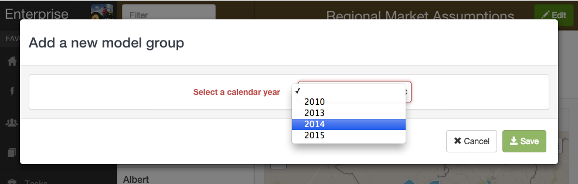
 

Your region should now display a new tab for the year you selected. 

**Add/Edit model assumptions**

1. Select which model you would like to edit by selecting one of the production year tabs below the map. If you only see a tab with a plus sign (+) and not a year, first complete the 'Create a new model' step above.
2. Click the Edit button in the upper right corner of the window to edit the assumptions for the selected region and year. 

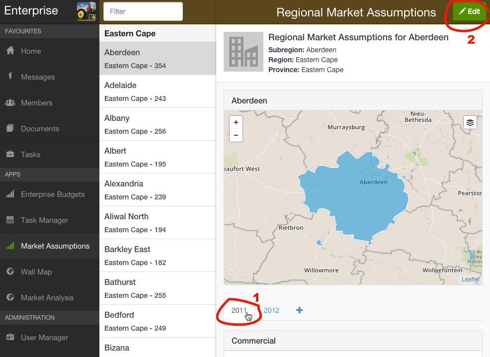
 

3. You should now see an editing window. Select one of the tabs at the top to set assumptions for each of the different farming operation types. Commercial farmers may plant more Maize than a Smallholder, for example.
4. Select a commodity type from the dropdown list to add it.
5. Enter the number of units of each commodity type that a typical farmer in the region would have. For crops and horticulture, this would be an area (ha, acres, etc.), but for livestock it is a number of herds.
6. Select an enterprise budget for each commodity type. This will supply income and expense amounts, as well as the number of animals per herd and stocking density if it is a livestock budget.
7. Once you have added commodities for each farming operation type (commercial, smallholder, and recreational), click Save. 

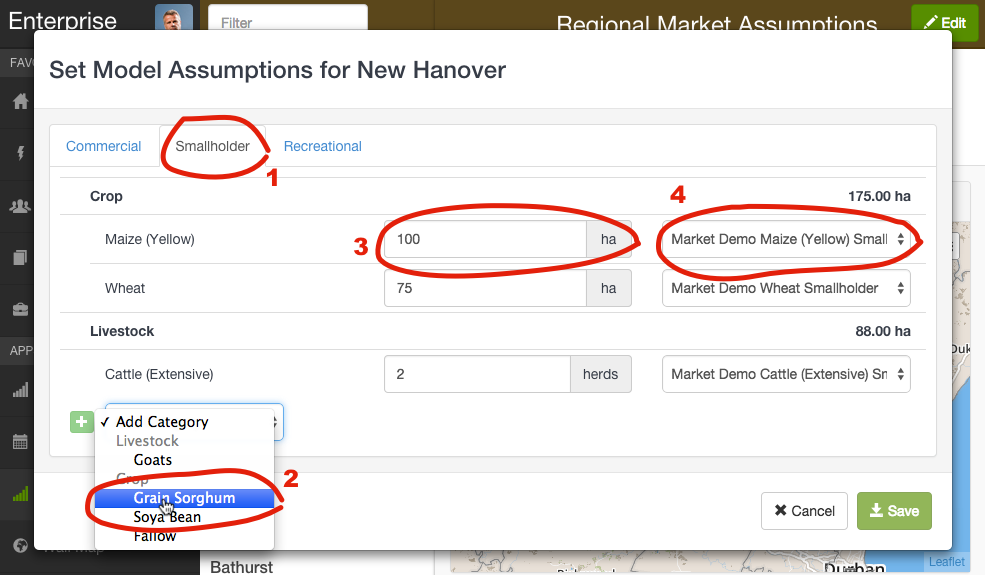
 

Repeat for each region.

## View market analysis map

You are now ready to view and export the results of your Market Analysis model. The following sections provide instructions for viewing the Market Analysis map, changing the map's parameters to filter the model data, and viewing and exporting model results for a particular production region.

### Viewing the map

1. Navigate to Market Analysis on the main menu.
2. You should see a map showing all of your production regions. Each region is coloured according to the legend shown to depict the market share in each region. If a region is grey, assumptions have not been set for that region. 

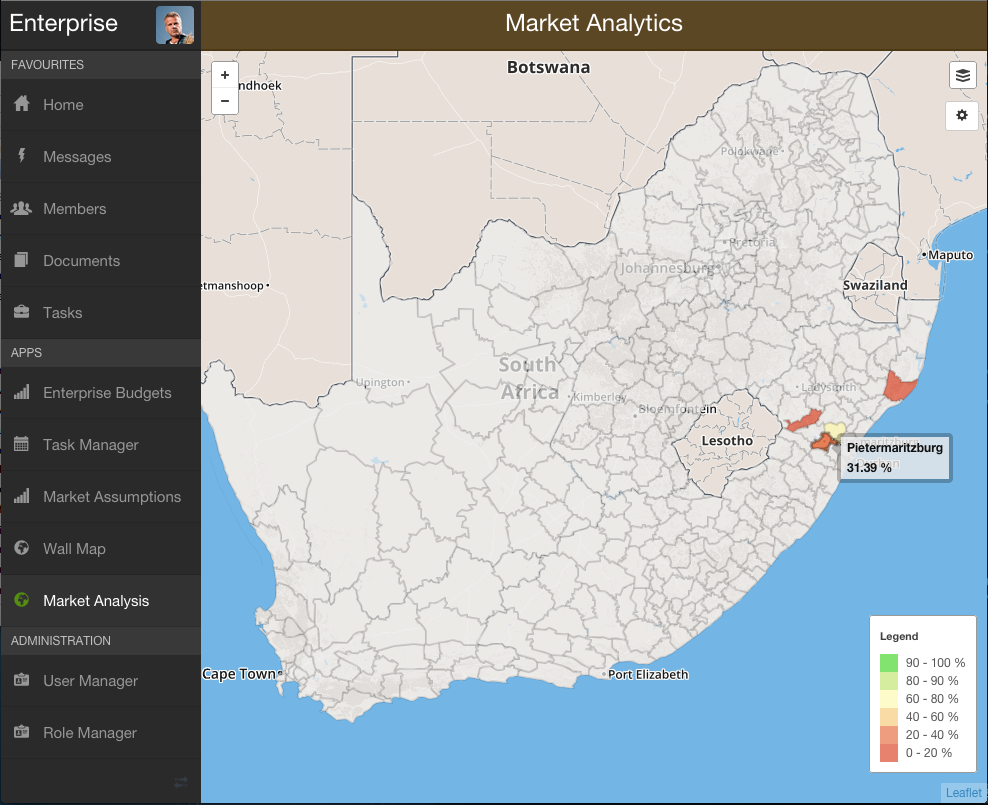
 

### Changing map options

1. Navigate to Market Analysis on the main menu.
2. Click the |settings| button on the map to open the settings menu

.. |settings| image:: market-analysis/ENT_MA_map_settings_button.png)
 Map settings button

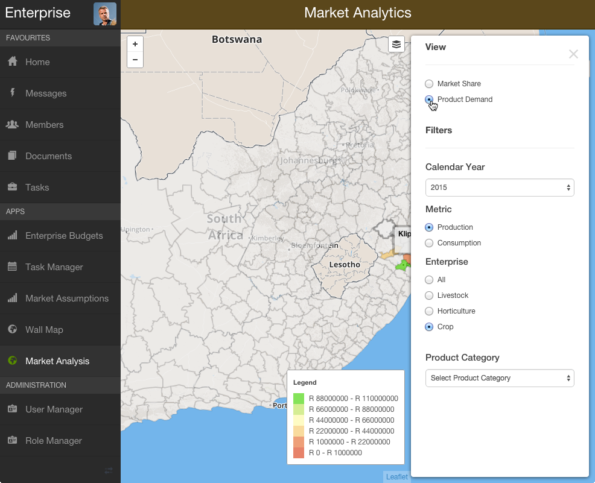
 

**Changing map view** 

Select a view from the 'View' section of the settings menu.

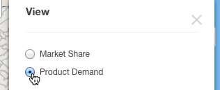
 

**Change model production year**

Select a model year from the dropdown menu labelled 'Calendar Year'.

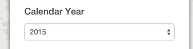
 

**Select economic function (Product Demand view only)**

With the 'View' option set to 'Product Demand', select either 'Production' or 'Consumption' from the 'Metric' section of the settings menu. This will change the values on the map and the filter options in the settings menu to represent either what is being produced or consumed by farmers in each region.

Examples of product categories that would be produced by farmers:

* Crops (Maize, Wheat, Soybeans, etc.)
* Milk
* Wool
* Livestock sold (Ewes, Bulls, Sows, etc.)

Examples of product categories that would be consumed by farmers:

* Crop insurance
* Animal feed
* Fertilizer
* Seed
* Veterinary and husbandry services
* Labour

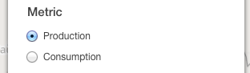
 

**Filter by enterprise type** 

Select an enterprise type option from the 'Enterprise' section of the settings menu. This changes the values on the map to represent only market share/product demand for the selected enterprise type, and filters the available commodity options in the settings menu. 

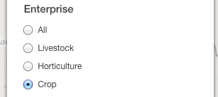
 

**Filter by commodity (Market Share view only)**

With the 'View' option set to 'Market Share', select a commodity type from the 'Commodity' section of the settings menu. This changes the values on the map to represent only market share for the selected commodity type.

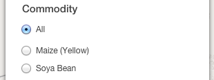
 

**Filter by product category (Product Demand view only)**

With the 'View' option set to 'Product Demand', select a product category from the dropdown menu in the 'Product Category' section on the settings menu. This changes the values on the map to represent only product demand for the selected product category.

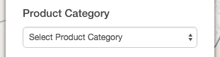
 

### View regional details

When viewing the Market Analysis map, click on a region. This will open a window displaying detailed model estimates for the chosen region for either market share or product demand, depending on the current map view.

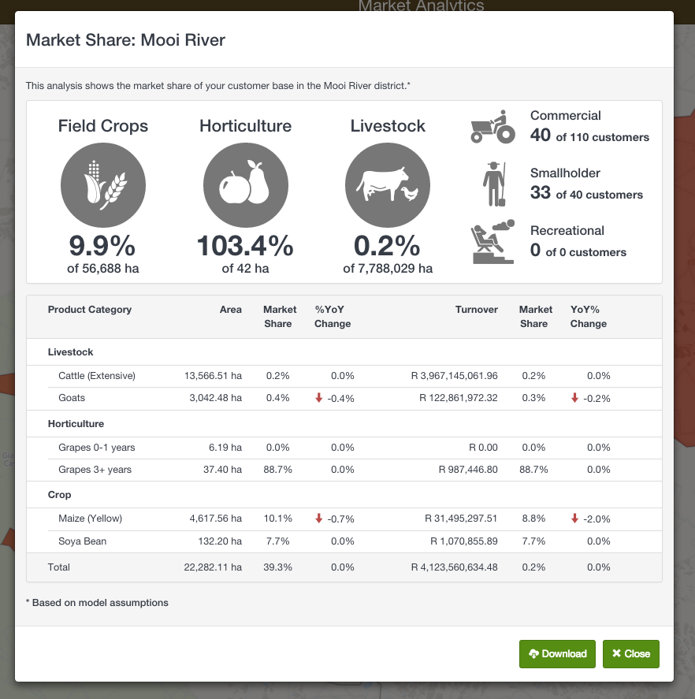
 

When viewing product demand details, click either the 'Production' or 'Consumption' tab at the top of the window to toggle the economic function (see 'Select economic function' above).

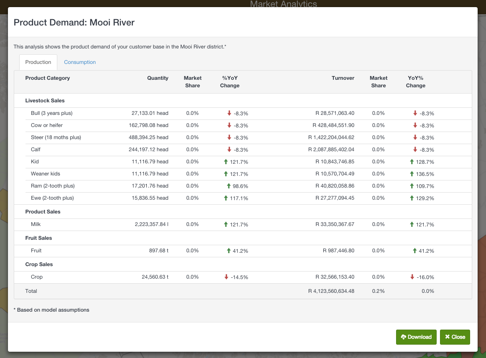
 

### Exporting model estimates

When viewing the Market Analysis map, click on a region. This will open a window displaying detailed model estimates for the chosen region for either market share or product demand, depending on the current map view. To export the data shown in the window, click the |Download| button at the bottom of the window. You will then be prompted to save a .csv file with the regional data.

.. |Download| image:: market-analysis/ENT_MA_download.png Download model data

The downloaded file can be opened in MS Excel or most other spreadsheet programs.