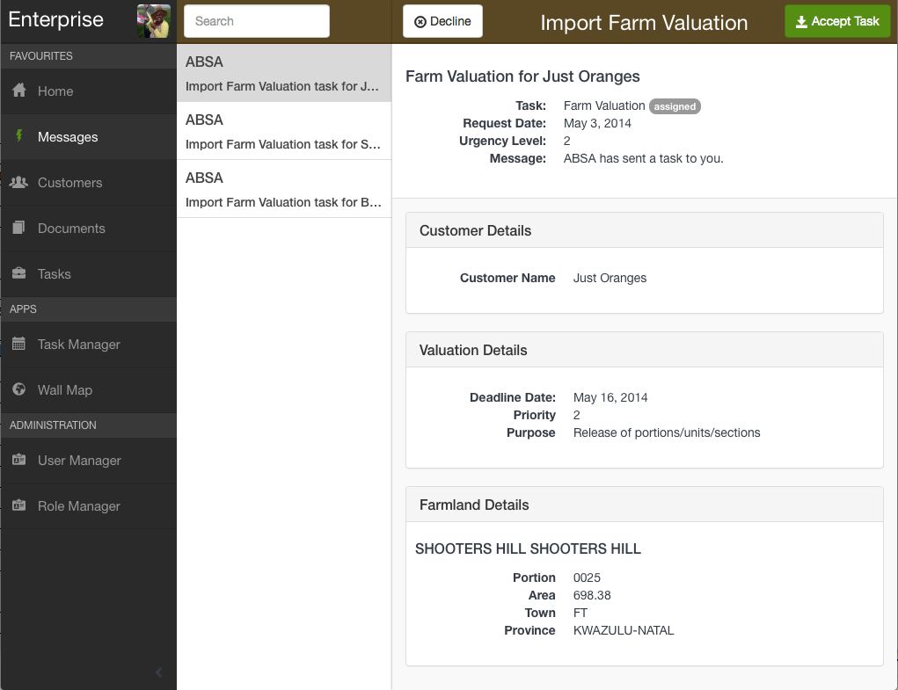
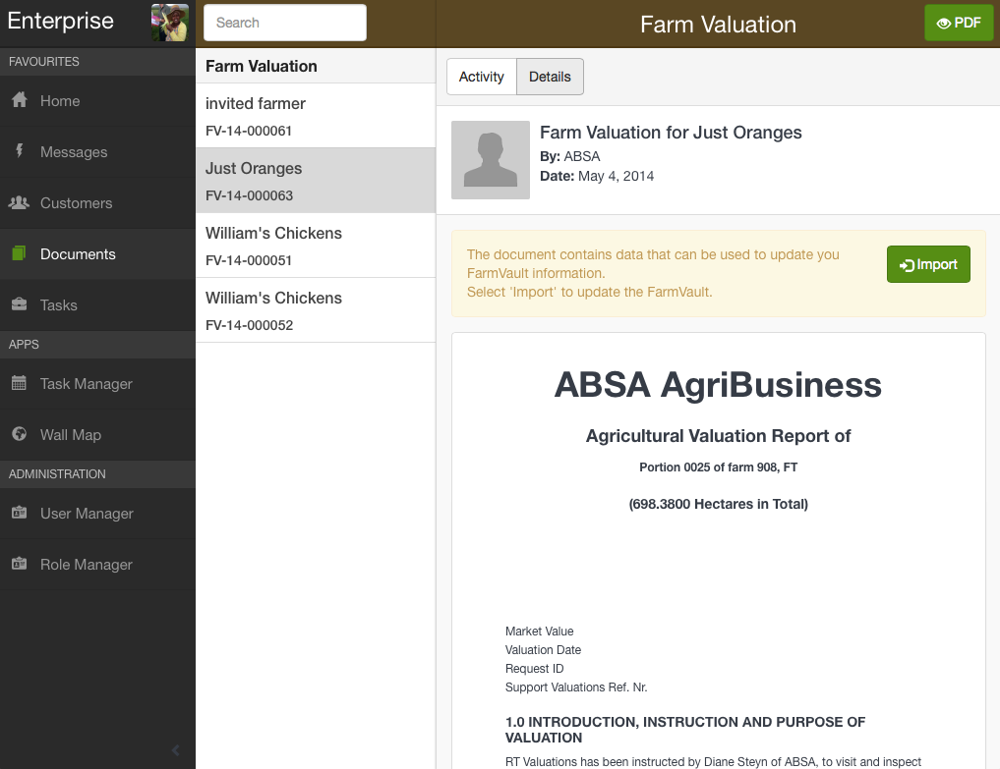
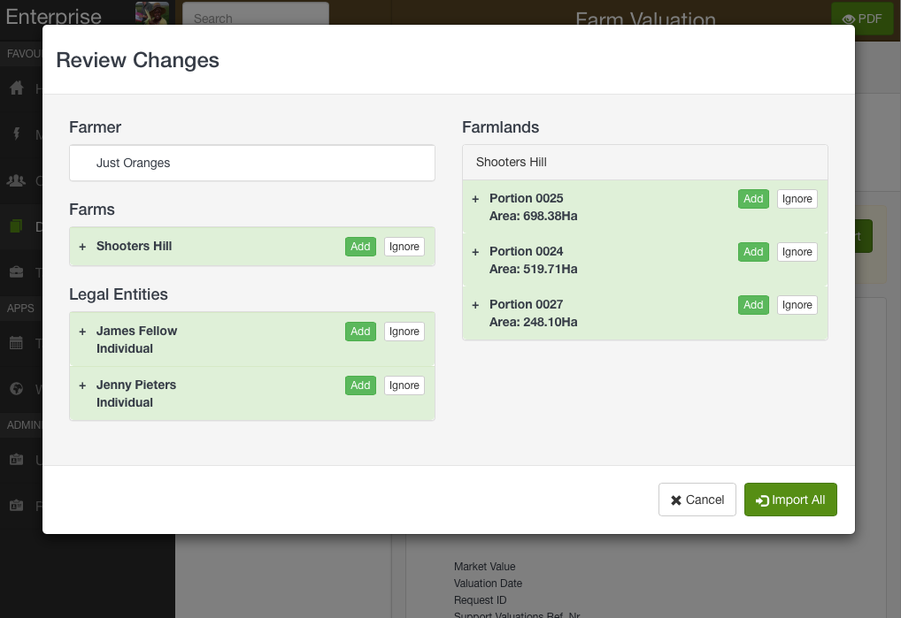
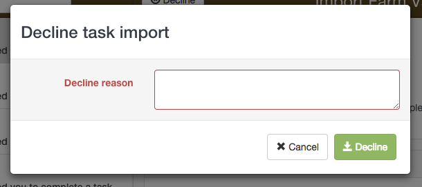
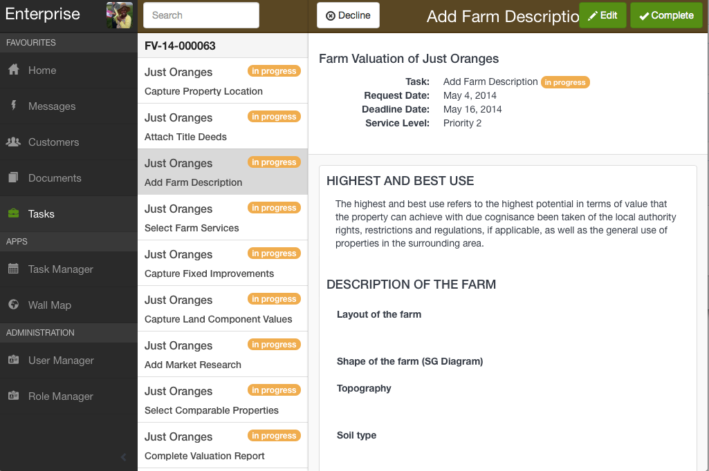
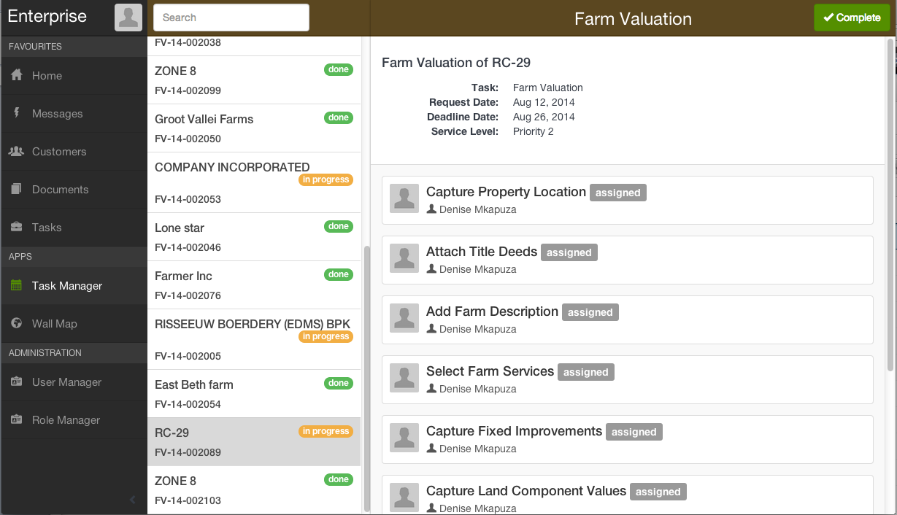
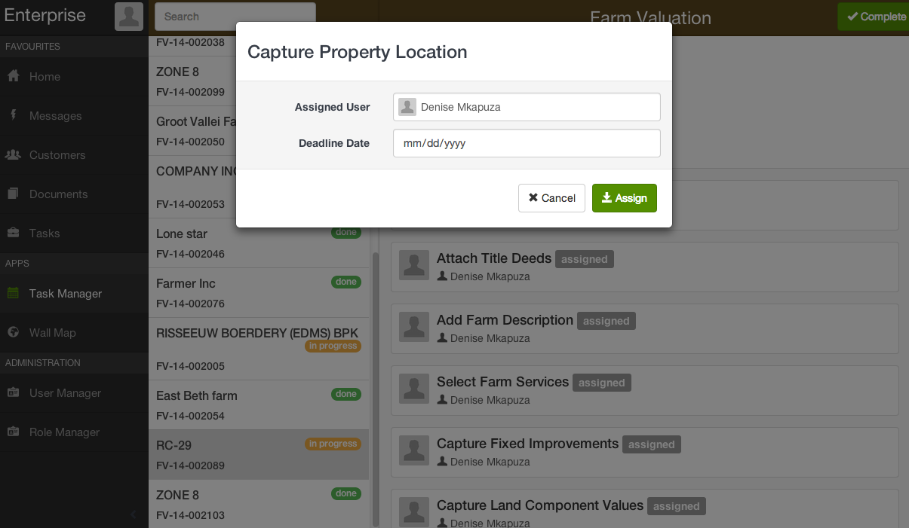

## Receive valuation request

A farm valuation request is sent to the primary account holder as an email, and as a message in their Enterprise account.

1. Log in to the Enterprise Portal and select Messages on the side menu. 
2. The message informs the user that they have been sent a farm valuation request. 

Details of the valuation request are displayed.

Note This message is visible to all of the users in your Enterprise instance

### Accept the request and Import Data

1. Click the Accept Task button

The screen will automatically refresh to display a valuation report template. This template contains the customer data sent along with the request.

2. Click the Import button to extract customer data from the smart document. A review window will open to show the proposed changes to the customer account. If this is a new customer all the changes will be shown as new additions (green). 
3. Select Import All to update the Customer Portfolio. 

Note: The person who accepts the request will automatically be assign all of the valuation tasks

### Decline request

If you choose to decline a valuation request, you must input a reason for the decline. 

1. Click the Decline button
2. Enter a reason and click the Decline button

--------

## View and assign tasks

All tasks associated with the farm valuation capture are displayed in the tasks menu.

### Assign staff to tasks

Tasks can be assigned to other users by navigating to the Task Manager app. 

1. Select Task Manager from the main menu
2. Search for the relevant customer in the task list
3. Select the task you wish to reassign 

4. Select a user from the list and click Assign   

  
This user will receive an email informing them of their new task.

Note: You can use the Assign All button to assign all of the valuation tasks at once  